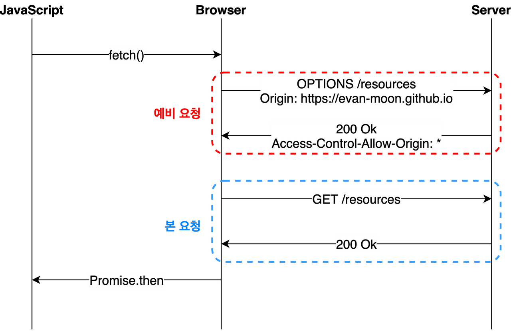
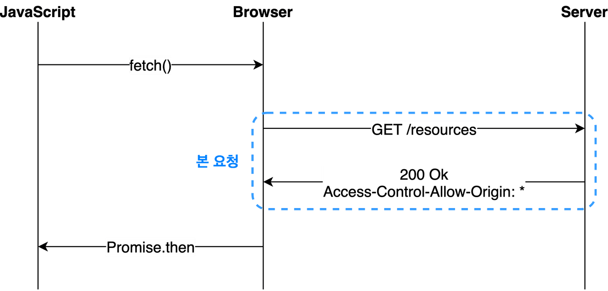

# CORS
CORS는 악명높은 애러다 웹 개발을 하다보면 한번쯤은 마주치게 되는 오류인데 프론트엔드, 백엔드 개발자가 코드를 이상하게 적은 것도 아니고 설정이 이상한 것도 아닌데 이상하게 오류가 발생한다면 대부분은 CORS오류이다

# CORS란?
먼저 CORS에 대해 알아볼 필요가 있다<br>
CORS는`Cross-Origin Resource Sharing`의 줄임말로 **교차-출처 리소스를 공유**하고도 한다

즉 다른 출처라고도 말할 수도 있는데 다른 출처이기 때문에 오류가 발생하는 것이다<br>
좀 더 풀어서 이야기 하자면 CORS는 한 도매인이 다른 도매인 간의 요청을 가진 다른 도매인의 리소스를 액세스할 수 있게 해주는 보안 메커니즘으로 최신 브라우저에서 구현된 동일 출처의 정책 때문에 등장하게 되었다

위에서 동일 출처 정책이라고 나왔는데 동일 출처 정책이 무엇이냐면<br>
**동일한 출처의 리소스에만 접근이 가능하도록 제한하는 정책**을 말한다<br>
여기서 말하는 출처는 프로토콜, 호스트명, 포트가 같다는 것을 의미한다

여기서 CORS동작원리에 대해 알아보자
기본적으로 웹에서 다른 출처로 리소스를 보낼 때 HTTP프로토콜을 사용하여 요청을 보내게 되는데 이때 브라우저는 origin이라는 필드에 요청을 담아서 보내게 된다
```
Origin:http://boxinthechaos.github.io
```
이후 서버가 이 요청에 대한 응답을 응답헤더 **Access-Control-Allow-Origin**라는 값에 이 리소스가 접근을 허용하는 출처를 같이 보내고 응답을 받은 브라우저는 **Access-Control0Allow-Origin**를 비교하고 이 응답이 유효한지 판별한다

기본적인 흐름은 이렇게 되지만 CORS는 동작하는 방식이 한 가지 방식이 아닌 세 가지의 시나리오에 따라 변화하기 때문에 어떤 시나리오에 해당하는지 잘 파악한다면 CORS문제를 해결하는데 도움이 될 것이다

## 1. Preflight Request
CORS문제를 마주쳤다면 가장 많이 보이는 문제이다<br>
브라우저는 요청을 한번에 보내지 않고 에비 요청과 본 요청을 나누어서 서버에 보내게 되는데<br>
이때 브라우저가 보낸 예비요청을 Preflight라고 부른다 예비 요청의 목적은 본 요청을 보내기 전에 브라우저가 본 요청을 보내도 안전한지 확인하는 용도이다<br>
(알기 쉽게 예시를 들어보자면 **조선시대 왕이 식사를 하기전 시녀가 먼저 음식을 먹어보고 독이 들어 있는지 안들어 있는지 확인**하는 것과 비슷하다고 생각이 든다)

preflight 방식도 위에서 설명한 것처럼 출처 판별과 같은 방식으로 이루어 진다 앞에 예비 요청이 포함 될 뿐
> 1. 브라우저는 보내는 http프로토콜의 Origin 필드에 리소스를 요청하는 출처를 보낸다
> 2. 브라우저는 서버 응답의 Access-Control-Allow-Origin 필드값을 보냈던 Origin 값과 비교하여 CORS 에러 여부를 판별한다

이 때 CORS 에러는 예비 요청의 성공 여부와 별 상관이 없다

브라우저가 CORS 여부를 판단하는 시점은 예비 요청의 응답을 받은 이후이기 때문이다<br>
솔직히 예비 요청 자체가 실패해도 CORS정책 위반으로 처리 될 수도 있지만 중요한 것은 예비 요청의 성공/실패여부가 아닌
**'응답 헤더에 유효한 Access-Control-Allow-Origin이 있는가'**<br>
이다<br>
그래서 헤더에 저 값이 제대로 들어가 있다면 CORS 정책 위반이 아니라는 뜻이다

## 2. Simple Request
MDN의 CORS문서에서 [Simple request](https://developer.mozilla.org/ko/docs/Web/HTTP/CORS#%EC%A0%91%EA%B7%BC_%EC%A0%9C%EC%96%B4_%EC%8B%9C%EB%82%98%EB%A6%AC%EC%98%A4_%EC%98%88%EC%A0%9C)라고 부른다<br>
단순 요청은 예비 요청 없이 바로 서버에서 본 요청만 보내는 것이다
즉 위의 Preflight와 로직은 같지만 예비 요청의 유무만 다른 것이다

하지만 아무 때나 Simple request를 사용할 수 있는 것이 아닌 특정 조건을 만족했을 때만 사용이 가능하다 다만 이 조건이 생각보다 까다롭기 때문에 잘 경험할 수 없는 방법이다
> ### 조건
> 1. 요청의 메소드는 get,head,post중 하나
> 2. Accept, Accept-Language, Content-Language, Content-Type, DPR, Downlink, Save-Data, Viewport-Width, Width를 제외한 헤더를 사용하면 안된다
> 3. 만약 Content-Type를 사용하는 경우에는 application/x-www-form-urlencoded, multipart/form-data, text/plain만 허용된다<br>
> 
> 이 부분은 이해가 잘 되지 않기 때문에 대략적으로 적어두고 나중에 자세히 알아 볼 것이다

## 3. Credentialed Request
인증된 요청을 사용하는 방법<br>
이 방식은 CORS의 기본적인 방법이라 보다 출처간의 통신의 보안을 강화가기 위해서 사용된다

기존 브라우저가 제공하는 XMLHttpRequest 나 fetch API는 별도의 옵션 없이 브라우저의 쿠키 정보나 인증과 관련된 헤더를 요청에 함부로 담지 않는데 이때 요청에 인증과 관련된 정보를 담을 수 있게 해주는 옵션이 바로 Credentialde 옵션이다

3가지의 옵션이 들어갈 수 있으면 각 값들의 가지는 의미는 아래와 같다
| 옵션 값 | 설 |
| ------ | --- |
| same-origin (기본값)	| 같은 출처 간 요청에만 인증 정보를 담을 수 있다 |
| include | 모든 요청에 인증 정보를 담을 수 있다 | 
| omit | 모든 요청에 인증 정보를 담지 않는다 |

만약 same-origin이나 include 와 같은 옵션을 사용하여 리소스에 인증 정보가 포함이 된다면 이제 브라우저는 다른 출처의 리소스에서 요청할 때 단순히 Access-Control-Allow-Origin만 확인 하는 것이 아닌 좀더 빡빡한 검사를 하게된다

~~더 자세히 알아 보는 것이 좋지만 지금은 CROS에 대해 알아보는 것이기 때문에 나중에 더 자세히 알아 보겠다~~

# CORS 해결 방법
CORS가 어렵게 느껴지는 이유는 바로 프론트와 백에서 문제가 발생하는 원인도 적지 않을 것이다

**즉 에러 자체는 프론트엔드 쪽에서 발생하지만 오류의 해결은 백엔드가 해야하는 상황이기 때문에** 문제 원인을 발견하기도 쉽지 않고 문제를 해결하는 것도 어렵기 때문이다

따라서 원래대로라면 백엔드에서 오류를 해결해야 하지만 백엔드에서 바로 오류 해결이 불가능 할 경우가 있기 때문에 프론트 쪽에서 해결하는 방법도 알아볼 예정이다

**먼저 프론트 쪽에서 해결하는 방법을 알아 볼 것이다**
## 프론트엔드
### 1. 다른 사람이 만든 프록시 서버 사용하기
요청해야할 URL 앞에 프록시 서버 URL을 붙여 요청하게 되면 해결이 가능하다

https://cors-anywhere/herokuapp.com<br>
^ 해당 서버를 활용해 준다면 요청을 가로채 HTTP 응답 해더에 `Access-Control-Allow-Origin : *`를 설정해주면 된다
```
axois({
  method:"GET",
  url:`https://cors-anywhere/herokuapp.com/{URL},
  header:{
	'APIKey':'....'
  }
})
```
코드 예시 출처 : [출처](https://velog.io/@sebinn/CORS-%EB%B0%9C%EC%83%9D-%EC%9B%90%EC%9D%B8%EA%B3%BC-%ED%95%B4%EA%B2%B0-%EB%B0%A9%EB%B2%95)
### 2. 클라이언트 : http-proxy-middleware 사용하기
`http-proxy-middleware`를 설치한 후에 setupProxy.js라는 파일을 src폴더 내에 생성 후 다음의 코드를 작성해 준다
```
const { creatProxyMiddleware } = require("http-proxy-middleware")

module.exports = function (app) {
    app.use(
            "/api",
            createProxyMiddleware({
                    target: "http://localhost:5000",
                    changeOrigin: true,
            })
    )
}
```

## 백엔드
### 서버에서 해결하기
동작원리를 보면 서버에서 Access-Control-Allow-Origin 해더에 유효한 값을 포함하여 응답을 브라우저로 보내면 CORS 에러를 해결할 수 있다

프론트단에서 CORS 에러를 발견했다면 서버에게 Access-Control-Allow-Origin에 유효한 값을 포함해서 달라고 요청해야 한다

와일드 카드격인 * 을 사용하여 Access-Control-Allow-Origin에 해더를 세팅하면 모든 출처에서 오는 요청을 받겠다는 의미로 당장은 편하겠지만 보안적으로 심각한 이슈가 발생할 수 있다

그러니 Access-Control-Allow-Origin: 특정 주소 와 같이 출처를 명시해주도록 합시다

해더는 서버의 엔진의 설정해서 추가할 수도 있지만 아무래도 복잡한 세팅을 하기에 불편하기 때문에 소스 코드내에서 응답 미들웨어를 사용하여 세팅하는 것을 추천한다고 한다

Node.js의 Express 는 cors 라는 서드파티 미들웨어를 지원한다고 한다<br>
이처럼 다른 프레임워크에서도 cors를 해결해주는 라이브러리가 존재한다

내가 Spring을 쓰니까 spring도 알아볼거다

### 1. Spring 자체 기능으로 해결(기본적으로 가장 많이 이용되는 방법)
`@CrossOrigin` 어노테이션 사용
```
@RestController
@CrossOrigin(origins = "http://localhost:3000")
public class MyController{
    //...
}
코드 출처: GPT 
```
전역 CORS 설정(가장 깔끔한 방식)
```
@Configuration
public class WebConfig implements WebMvcConfigurer {
    @Override
    public void addCorsMappings(CorsRegistry registry) {
        registry.addMapping("/**")
                .allowedOrigins("http://localhost:3000")
                .allowedMethods("GET", "POST", "PUT", "DELETE")
                .allowCredentials(true);
    }
}
코드 출처 GPT
```
### 2. 필요한 경우 사용할 수 있는 라이브러리들
> 대부분은 Spring 자체 기능으로 해결이 가능하지만 아래처럼 **보안 레벨**이 높은 설정이 필요하거나, WebFlux를 쓴다면 사용할 수 있는 라이브러리들이다

1. Spring Cloud Gateway
- `WebFlux`기반에서 CORS를 필터 형태로 처리할 수 있음\
- React/Vue 프론트와 마이크로서비스 연동 시 유용

2. CorsFilter (Servlet Filter 방식)
- Spring Security 적용 시 Security Filter 전에 CORS를 처리해야 할 때 사용
```
@Bean
public FilterRegistrationBean<CorsFilter> corsFilter() {
    UrlBasedCorsConfigurationSource source = new UrlBasedCorsConfigurationSource();
    CorsConfiguration config = new CorsConfiguration();
    config.setAllowCredentials(true);
    config.addAllowedOrigin("http://localhost:3000");
    config.addAllowedHeader("*");
    config.addAllowedMethod("*");
    source.registerCorsConfiguration("/**", config);
    FilterRegistrationBean<CorsFilter> bean = new FilterRegistrationBean<>(new CorsFilter(source));
    bean.setOrder(0);
    return bean;
}
코드 출처: GPT
```
만약 Spring Security를 사용하고 있다면
`SecurityFilterChain`설정에서 CORS를 허용해줘야 한다
```
@Bean
public SecurityFilterChain securityFilterChain(HttpSecurity http) throws Exception {
    http
        .cors().and() // 여기가 중요
        .csrf().disable()
        .authorizeHttpRequests()
        .anyRequest().permitAll();
    return http.build();
}

@Bean
public CorsConfigurationSource corsConfigurationSource() {
    CorsConfiguration configuration = new CorsConfiguration();
    configuration.setAllowedOrigins(List.of("http://localhost:3000"));
    configuration.setAllowedMethods(List.of("GET","POST","PUT","DELETE"));
    configuration.setAllowedHeaders(List.of("*"));
    configuration.setAllowCredentials(true);
    UrlBasedCorsConfigurationSource source = new UrlBasedCorsConfigurationSource();
    source.registerCorsConfiguration("/**", configuration);
    return source;
}
코드 출처 GPT
```
참고 : [참고 1](https://velog.io/@sebinn/CORS-%EB%B0%9C%EC%83%9D-%EC%9B%90%EC%9D%B8%EA%B3%BC-%ED%95%B4%EA%B2%B0-%EB%B0%A9%EB%B2%95),
[참고 2](https://velog.io/@jh100m1/CORS-%EC%97%90%EB%9F%AC%EA%B0%80-%EB%AD%94%EB%8D%B0-%EC%96%B4%EB%96%BB%EA%B2%8C-%ED%95%B4%EA%B2%B0%ED%95%98%EB%8A%94%EA%B1%B4%EB%8D%B0#-cors%EC%9D%98-%EB%8F%99%EC%9E%91%EC%9B%90%EB%A6%AC%EA%B0%80-%EB%AD%90%EC%A7%80-)