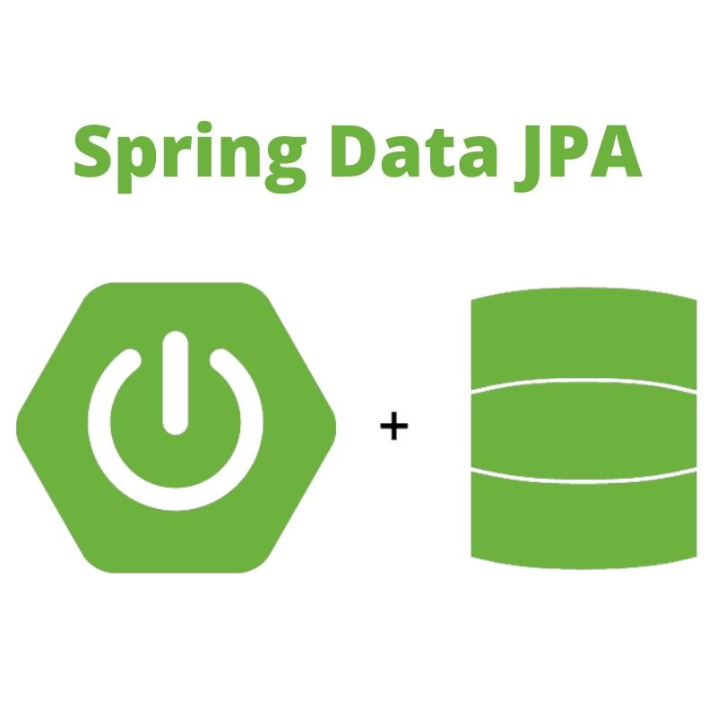
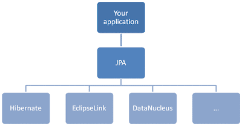
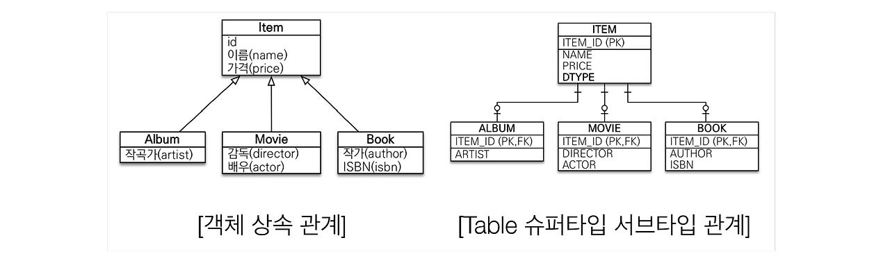
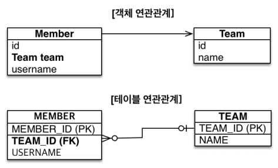
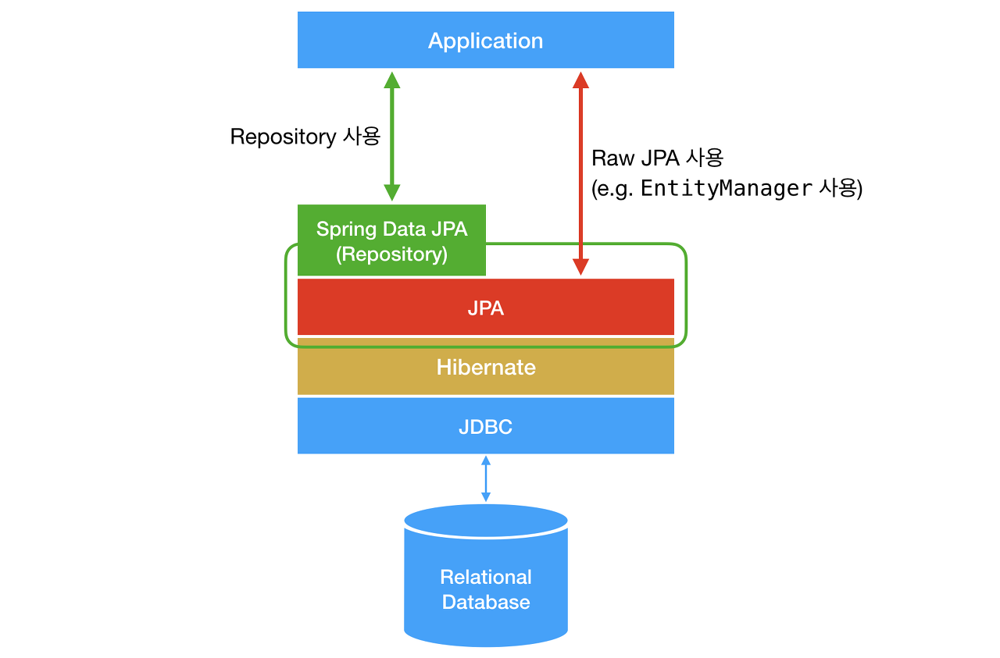

# JPA란
JPA는 자바 진영에서 OMR(Object-Relational Mapping) 기술 표준으로 사용되는 인터페이스 모음이다
그말은 즉 실제로 구현된 것이 아닌 구현된 클래스와 매핑을 하기 위해서 사용되는 프레임워크이다
JPA를 구현한 대표적인 오픈소스로는 Hibernate이 있다


# OMR(Object-Relational Mapping)이란
우리가 일반적으로 알고 있는 애플리케이션 class와 RDB(Relational DataBase)의 테이블을 연결하는 뜻이다
기술적으로는 어플리케이션의 객체를 RDB 테이블에 자동으로 영속화 해주는 것으로 보면 된다

## OMR 장점
1. SQL문이 아닌 Method를 통해 DB를 조작하기 때문에 객체 모델을 이용하여 비지니스 로직을 구축하는데만 집중 가능
    - 내부적으로는 쿼리를 생성하여 DB를 조작한다
2. Query와 같은 선언문, 할당 같은 부수적인 코드가 줄어들어 각종 객체에 대한 코드를 별도로 작성하여 가독성을 올릴수 있음
3. 객체지향적인 코드 작성이 가능함, 오직 객체지향적 접근만 고려하면 되기 때문에 생산성이 증가함
4. 매핑하는 정보가 Class로 명시 되어 있기 때문에 ERD를 보는 의존도를 낮출 수 있고 유지보수및 리팩토링에 유리하다
5. 기존 방식에서 MySQL 데이터베이스를 사용하다가 PostgreSQL로 변환한다고 가정해보면 새로 쿼리를 짜야할 경우가 생기는데 OMR를 사용하면 쿼리를 수정 할 필요가 없다

## OMR 단점
1. 규모가 크고 복잡하면 속도 저하및 일관성을 감소시킬 수 있다
2. 복잡하고 무거운 Query는 속도를 위해서 튜닝이 필요하기 때문에 결국 SQL문을 써야할 수 있다
3. 학습비용이 비싸다

# JPA(Java Persistence API)
- Java 진영에서 OMR기술 표준으로 사용하는 인터페이스들의 모음
- 자바 어플리케이션에서 관계형DB를 사용하는 방식을 정의한 인터페이스
- 인터페이스이므로 Hibernate, OpenJPA등이 JPA를 구현했다



# JPA 사용 이유
1. JPA는 반복적인 CRUD SQL를 처리해준다
2. JPA는 매핑된 관계에서 SQL를 생성하고 실행하는데 개발자는 어떤 SQL이 실행될지 생각하면 되고 쉽게 예측이 가능하기 때문이다
3. JPA는 네이티브 SQL이란 기능을 제공하는데 관계 매핑이 어렵거나 성능에 대한 이슈가 우려될 경우 직접 SQL을 작성할 수 있다
4. **SQL이 아닌 객체 중심으로 개발이 가능하다** 
   > 이에 따라 생산성이 좋아지고 유지보수도         수월해진다 또한 JPA 패러다임의 불일치도 해결 가능하다 예시를 들자면 JAVA에서는 부모클래스와 자식 클래스의 상속관계가 존재하는데 데이터베이스에서는 이런 상속관계를 지원하지 않는다
   이런 상속 관계를 JPA에서는 아래 사진과 같이 처리한다


위 사진과 같은 구조에서 만약 Album 클래스를 저장한다고 가정해보면
```
jap.persist(album);
```
그러면 JPA는 위의 코드를 아래의 쿼리로 변환해서 실행한다
```
INSERT INTO ITEM (ID, NAME, PRICE) .....
INSERT INTO ALBUM (ARTIST) .....
```
위처럼 저장되면 당연하게도 조회할 때 두 테이블를 엮어서 가져온다 그래서 조회하는 JAVA코드와 변환되는 쿼리를 보도록 하자
```
// 자바 코드
String albumId = "id100";
Album album = jpa.find(Album.class, albumId);
// 변환된 쿼리
SELECT I.*, A.*
  FROM ITEM I
  JOIN ALBUM A ON I.ITEM_ID = A.ITEM_ID
```
위와 같이 상속 관계도 지원 해주는데 객체지향에는 연관관계라는 것이 있다
코드로 따지고 보면 class에서 또다른 Class Type을 필드 변수로 가지고 있는 것이다
테이블 구조를 나타낸 그림을 보자
 
위의 그림은 Member 클래스가 Team타입의 team필드 변수를 가지고 있는 형태인데 코드로 보면
```
class Member { 
    String id;
    Team team;
    String username;
}

class Team {
    Long id;
    String name;
}
```
그렇다면 Team 객체를 참조하는 필드를 가지고 있는 Member 객체는 어떻게 저장하냐면 상속구조와 다를바가 없다 아래 JAVA 코드로 보면
```
Member member = new Member();
member.setId("100");
member.setUsername("pjsleey123");

Team team = new Tema();
team.setName("dev_team");

member.setTeam(team);
jpa.persist(member);
```
위처럼 Member 객체의 team 필드에 Team 객체를 set하고 Member 객체를 DB에 저장하게 된다면 JPA는 아래와 같은 코드를 데이터베이스에게 실행하라 한다
```
INSERT INTO MEMBER (ID, TEAM_ID, USERNAME) ....
INSERT INTO TEAM (ID, NAME) ....
```
이렇게 저장 후  Member 객체만 조회하면, Team 객체 정보도 가져와서 Member 객체의 team필드에 주입해주기 때문에 아래와 같이 사용할 수 있다
```
// JAVA 코드
Member member = jpa.find(Member.class, memberId);
Team team = member.getTeam();

// 변환된 쿼리
SELECT M.*, T.*
 FROM MEMBER M
 JOIN TEAM T ON M.TEAM_ID = T.TEAM_ID 
 ```
 위와 같은 구조들이 더 복잡해진다고 해도 JPA는 이를 모두 지원해주기 때문에 문제없이 사용할 수 있다.
 
 위에서 다룬 JPA의 저장 및 조회는 아래와 같은 구조로 실행된다

## -저장-

## 조회

참고로, JPA는 수정 메소드를 제공하지 않지만 당연히 수정은 필요하기 때문에 JPA는 데이터 수정시, 매핑된 객체(테이블 데이터)를 조회해서 값을 변경 후 커밋하면 DB 서버에 UPDATE 문을 전송하여 UPDATE를 실행한다

추가적으로 알아둬야 할 것은, 스프링에서 흔히 사용하는 것으로 알고있는 JPA는, JPA를 이용하는 spring-data-jpa 프레임워크이지 JPA는 아니다
