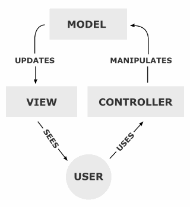
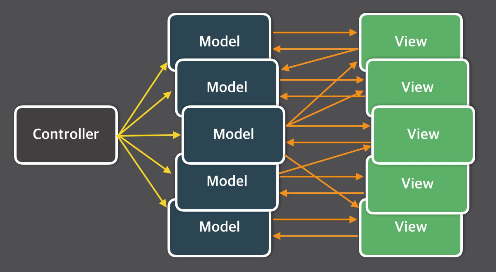
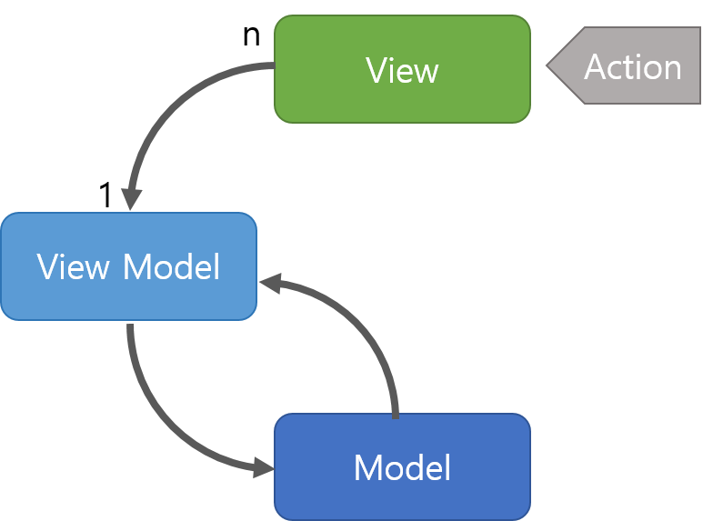
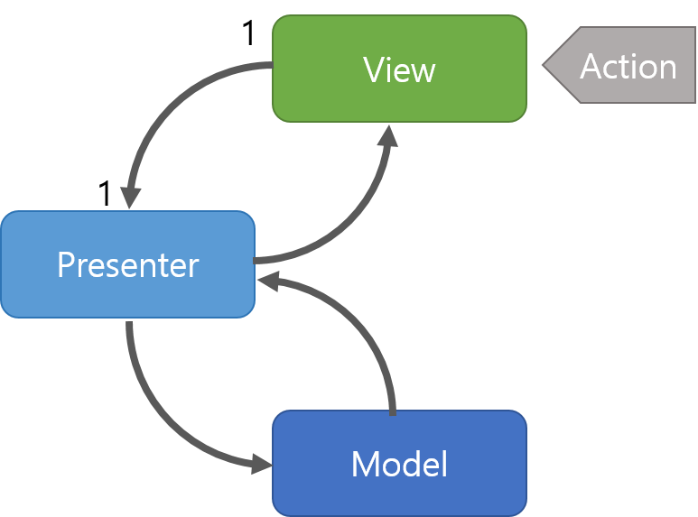

# MVC 패턴이란
MVC 패턴이란 M(Mdel),V(View),C(Controller)라는 개념으로 역활을 나누어서 일련의 작업을 처리하는 방법

# Mdel,View,Controller의 관계
Model,View,Controller이 무엇인지 알아보기 전에 이것들의 관계나 흐름을 알려주는 사진이다

사용자가 Controller를 사용하게 되면 Model에게서 데이터를 받아오고 받아온 데이터를 View에서 시각적인 부분을 제어하는 사용자에게 전달한다
위의 말을 3줄 요약 하자면
> 1. 사용자의 요청(Request)를 Controller이 받는다
> 2. Controller는 Service에서 비지니스 로직을 처리 한 후 Model에 담는다
> 3. Model에 저장된 결과를 바탕으로 시각적 요소 출력을 담당하는 View를 제어하는 사용자에게 보낸다

이렇게 Model,View,Controller의 관계와 흐름을 알아보았다 이제 이들이 각각 어떤 역활을 하는지 알아보자

## Model
**Controller에게 받은 데이터를 조작(가공)하는 역할을 수행** 즉 데이터와 관련된 부분을 담당하며 값과 기능을 가지는 객체이다

Model이 가지는 규칙은 다음과 같다
> 1. 사용자가 편집하길 원하는 모든 데이터를 가지고    있어야 한다
> 
> 2. View나 Controller에 대해서 어떤 정보도 알지 말아야 한다
> 
> 3. 변경이 일어나면, 변경 통지에 대한 처리방법을 구현해야만 한다 

## View
**Controller에게 받은 Model의 데이터를 사용자에게 시각적으로 보여주기 위한 역할을 수행** 즉 사용자에게 보여지는 화면이라 볼 수 있다

View의 규칙은 다음과 같다
> 1. Model이 가지는 정보를 따로 저장해서는 안된다
> 2. Modle이나 Controller를 알고 있을 필요가 없다
> 3. 변경이 일어나면 변경통지에 대한 처리방법을 구현해야한다

## Controller
**Controller는 Model과 View 사이에서 데이터 흐름을 제어한다 사용자가 접근한 URL에 따라 요청을 파악하고 URL에 적절한 Method를 호출하여 Service에서 비즈니스 로직을 처리한다 이 후 결과를 Model에 저장하여 View에게 전달하는 역할을 수행한다** 즉 Controller는 Model과 View를 분리하는 중요한 요소이다

Controller의 규칙은 다음과 같다
> 1. Model,View에 대해서 알고 있어야한다
> 2. Model,View의 변경을 모니터링 해야한다

위와 같이 Model, View, Controller가 어떤 역할을 수행하는지, 어떤 규칙을 가지는지를 알아보았다.

# 실전에서 MVC규칙을 지키며 코딩하기
MVC 구조로 개발을 한다면 Model, View, Controller의 역할과 규칙을 잘 따라야 하는데 이들의 규칙을 통해 정리한 내용은 다음과 같다
> 1. 모델은 컨트롤러나 뷰에 의존하면 안된다
>    - 모델 내부에 컨트롤로 및 뷰의 코드가 있으면 안된다
> 2. 뷰는 모델에만 의존해야 하고, 컨트롤러에는 의존하면 안된다
>       - 뷰 내부에 모델의 코드만 있을 수 있고, 컨트롤러의 코드가 있으면 안된다
> 3. 뷰가 모델로부터 데이터를 받을 때는 사용자마다 다르게 보여주어야 하는 데이터에 한해서만 받아야 한다
> 4. 컨트롤러는 모델과 뷰에 의존해도 된다
>       - 컨트롤러 내부에는 모델과 뷰의 코드가 있을 수 있다
> 5. 뷰가 모델로부터 데이터를 받을 때는 반드시 컨트롤러에서 받아야 한다

# MVC는 왜 생겨난 걸까?
MVC는 아마 소프트웨어 개발을 통틀어 가장 대중적인 패턴이 아닐까 생각된다

웹이나 앱을 포함하여 여러 플랫폼에서 가릴 것 없이 수많은 프레임워크들이 기본적으로 MVC 패턴을 채용하는 것으로 알고 있다

그렇다면 MVC 패턴은 어떻게 생겨난걸까?
> 1979년 제록스 팔로알토 연구소에서 **트라이브 린스케이지**라는 분이 MVC를 처음으로 만들었다고 한다

MVC의 초기 구조를 나타낸 그림을 MVC XEROX PARC 1978-79 자료에서 찾아볼 수 있었다

위 사진에서 사용자의 멘탈모델과 컴퓨터의 멘탈 모델을 표현한 것을 볼 수 있다. 여기서 인용된 문구를 추가로 살펴보면 아래와 같은 내용이 실려있다
>MVC was conceived as a general solution to the problem of users controlling a large and complex data set
>
>(MVC는 사용자가 크고 복잡한 데이터 세트를 제어하는 문제에 대한 일반적인 해결책으로 고안되었습니다.)

위 내용을 통해 결국 복잡하고 어려운 데이터들을 다양한 관점에서 다루기 위한 솔루션으로 MVC가 등장했음을 이해할 수 있었다

# MVC패턴을 사용해야 하는 이유
앞에서 MVC 패턴이 어떻게 만들어졌는지 알아보았다. 그렇다면 MVC 구조가 어떤 이점을 가져다 주는 것일까?

## 1. 관심사의 분리
먼저 MVC 패턴의 본질적인 목표는 MDN Web Docs의 내용대로 관심사를 분리하는 것이라고 생각한다
> 관심사 분리(separation of concerns, SoC)를 컴퓨터 프로그램을 구별된 부분으로 분리시키는 디자인 원칙으로, 각 부문은 개개의 관심사를 해결하는 것이라고 알수 있다

하지만 MVC 패턴에서 관심사를 분리한다는 것은 어떻게 나눌 것인가? 라고 말할 수도 있을 것 같다 

개발을 포함한 특정 작업을 수행해야 할 경우 자연스럽게 작업을 수행하기 위한 역할을 나누는 것부터 시작하게 될 것이다 

이는 결국 일반적으로 MVC 구조의 가이드라인을 따르게 된다고 느껴졌다
## 2. MVC 패턴의 또 다른 이점은
그렇다면 MVC 패턴을 통해서 관심사를 분리하는 것뿐만 아니라 다른 이점들은 무엇이 있을까? MVC 패턴의 이점들을 찾아보니 다음과 같은 내용들을 찾을 수 있었다
> 1. 컴포넌트의 명확한 역할 분리로 인해 서로간의 결합도를 낮출 수 있다
> 2. 코드의 재사용성 및 확장성을 높일 수 있다
> 3. 서비스를 유지보수하고 테스트하는데 용이해진다
> 4. 개발자 간의 커뮤니케이션 효율성을 높일 수 있다

# MVC 패턴의 한계점
MVC 패턴의 한계점은 다음과 같다
> 1. Model과 View의 의존성을 완전히 분리 할 수 없다
> 2. 컨트롤러의 비중이 높아져 부담이 커진다면 Massive-View-Controller 현상을 피할 수 없다
>       > Massive-View-Controller현상이란?
>       > 
>       > 위 사진처럼 하나의 Controller에 수많은 View,Model이 연결되어 있기 때문에 컨트롤러의 부하가 커지게 되는것이 Massive-View-Controller현상이라 한다

이렇게 MVC 패턴으로 인해 챙길 수 있는 이점들도 있지만 반대로 독이 되어 개발자에게 새로운 시련을 안겨줄 수 있음을 알 수 있었다 

# MVC 팬턴의 문제를 해결하기 위한 대안
그렇다면 이러한 MVC 패턴의 문제점을 해결하기 위해 생겨난 새로운 대안들이 있을까?

찾아보니 MVC 패턴의 문제를 해결하기 위해 아래와 같은 다양한 패턴들이 등장했다
- MVVM
- MVP
- MVW
- Flux
- Redux
- RxMVVM
자료에 MVVM 패턴과 MVP패턴에 나와있어서 그 두개만 정리 해 보겠다

## MVVM(Model-View-ViewModel)패턴

MVVM 패턴은 MVC 패턴의 한계를 극복하기 위해 개발된 패턴중 하나로 Model, View, View Model 요소로 이루어진 소프트웨어 아키텍처 패턴이다

여기서 Model과 View는 MVC 패턴에서 Model,View와 동일 하지만 중요한 것은 ViewModel이다 

ViewModel의 역활은 View와 Model 사이에서 중개자 역활을 하며 **View를 보여주기 위한 데이터 처리 역활을 수행하는 요소이다**
즉 View를 표현하기 위한 Model이라 생각하면 편하다

MVVM패턴 동작 순서는 다음과 같다
> 1. 사용자의 요청은 View를 통해 받게 된다
> 2. View에서 요청을 받는다면, Command 패턴으로 View Model로 요청을 전달한다
> 3. View Model은 Model에게 요청 처리에 필요한 데이터를 요청한다
> 4. Model은 내부적으로 비즈니스 로직을 수행하여 View Model에게 필요한 데이터를 전달한다
> 5. View Model은 전달받은 데이터를 가공하여 저장한다
> 6. View는 View Model과 Data Binding하여 사용자에게 요청에 적절한 화면을 출력한다

## MVP(Model-View-Presenter) 패턴

MVP 패턴 또한 MVC 패턴의 단점을 보완하기 위해 등장한 패턴으로, Model, View, Presenter로 구성되는 소프트웨어 아키텍처 패턴이다

여기서도 view와 model의 역활은 같지만 controller의 역활을 Presenter가 가져갔다고 생각하면 된다

Presenter는 Model과 View 사이에서 중개자 역할을 하며, MVC 패턴에서의 Controller와 유사하지만, View에 직접 연결되지 않고 사용자 인터페이스를 통해 상호작용하게 된다

MVP 패턴의 동작 순서는 아래와 같다.
> 1. 사용자의 요청은 View를 통해 받게 된다
> 2. View는 데이터를 Presenter에 요청한다
> 3. Presenter는 Model에게 데이터를 요청한다
> 4. Model은 요청을 통해 비즈니스 로직을 수행하여 Presenter에서 요청받은 데이터를 전달한다
> 5. Presenter는 View에게 전달받은 데이터를 응답한다
> 6. View는 Presenter가 응답한 데이터를 이용하여 화면을 출력한다