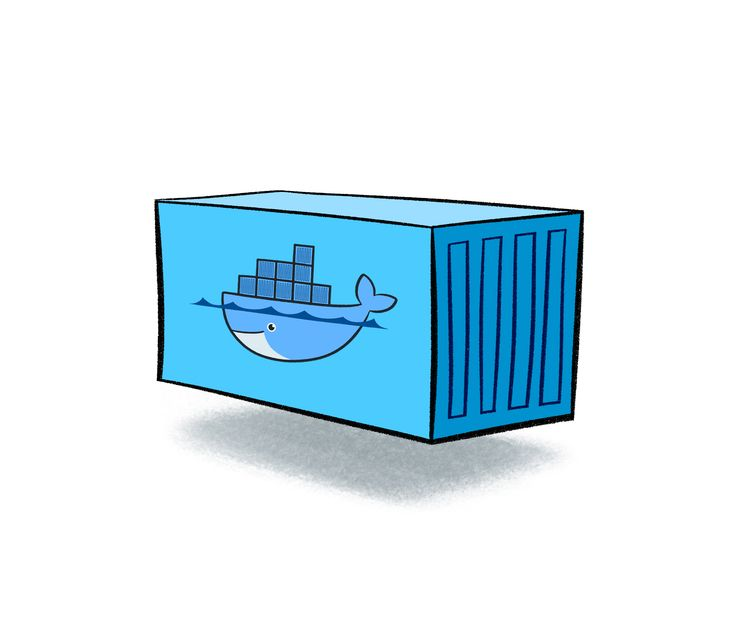
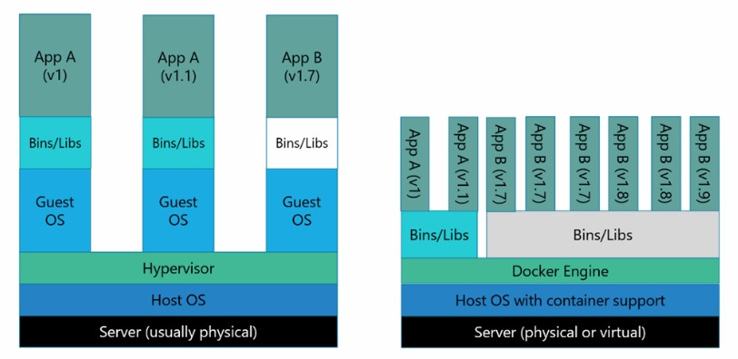
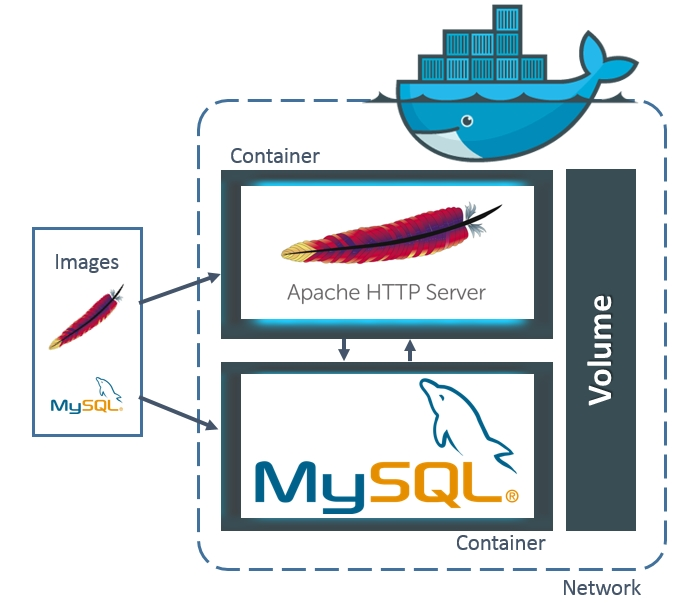
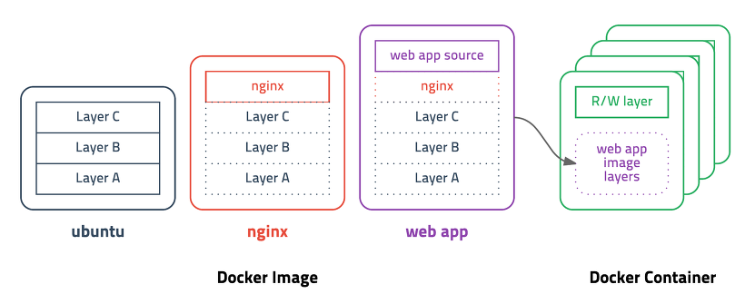
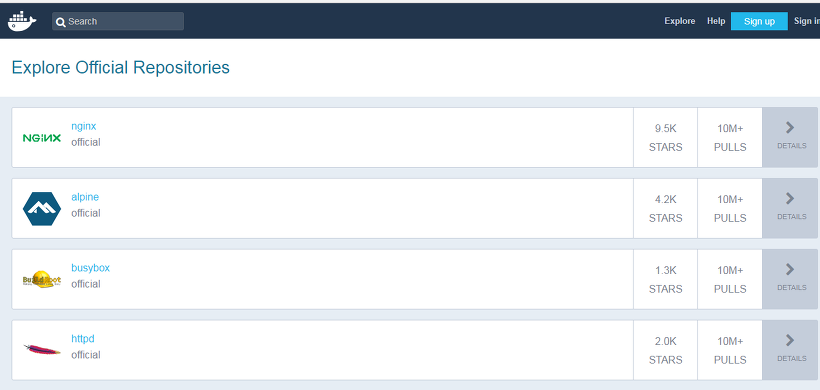
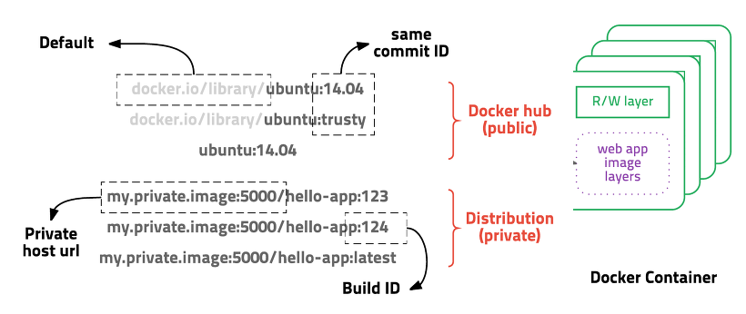

# docker
Docker란 Go언어로 작성된 리눅스 <span style="color:red">**컨테이너**</span> 기반으로 하는 <span style="color:red">**오픈소스 가상화 플렛폼**</span>이다

Docker 0.9버전부터 직접 개발한 libcontainer 컨테이너를 사용하고 있다

### 가상화를 사용하는 이유
요즘 컴퓨터의 성능을 더욱 효율적으로 사용하기 위해서 가상화 기술이 많이 등장하였다

서버관리자 입장에서 10%대 밖에 되지 않는 활용도가 낮은 서버로 리소스를 낭비하기에 너무 아쉽고 그렇다고 모든 리소스를 한 서버안에 올린다면 안정성에 문제가 발생할 수 있기 때문에 안정성과 소스를 최대로 활용할 수 있는 방법으로 등장한 것이 서버 가상화이다

모두가 아는 대표적인 가상화 플렛폼으로는  VM이 있다

VM은 누구나 아는 OS가상화이다 그렇다면 위에서 Docker을 설명할 때 나온 컨테이너는 무엇일까요?

## 컨테이너란?


컨테이너는 가상화의 기술중 하나로 대표적인 것으로는 LXC(Linux Container)이 있습니다

기존 OS를 가상화 시키던 것과 다르게 컨테이너는 <span style="color:red">**OS레벨의 가상화로 프로세스를 격리시켜 동작하는 방식**</span>으로 이루어집니다

한 서버에서 OS를 가상화 하여 사용하는 것과 컨테이너 방식으로 프로세스를 격리시켜 동작하는 방법은 어떠한 차이점이 있을까?

### VM 가상화 플랫폼 vs Docker 가상화 플랫폼 

기존에 우리에게 익숙한 VM같은 경우엔 Host OS 위에 가상화를 시키기 위한 Hypervisor 엔진 그리고 그 위에 Guest OS를 올려 사용합니다 이는 가상화된 하드웨어 위에 OS가 올라가는 형태로 거의 완벽하게 Host와 분리된다고 봐도 무방합니다

 반면에 컨테이너 기반 가상화는 Docker 엔진 위에 Application 실행에 필요한 바이너리만 올라가게 됩니다
 
  OS 가상화를 보면 Host OS와 완전히 분리되는 장점은 있지만 OS위에 OS를 올리기 때문에 무겁고 느릴수 밖에 없습니다 하지만 컨테이너 기반 가상화는 Host OS 그리고 Docker 엔진위에서 바로 동작하며 Host의 커널을 공유합니다
  
   커널을 공유하게 되면 io처리가 쉽게 되어 성능의 효율을 높일 수 있습니다

컨테이너를 사용하는 것은 가상 머신을 생성하는 것이 아니라 Host OS가 사용하는 자원을 분리하여 여러 환경을 만들 수 있도록 하는 것입니다

위에처럼 쓰고 나니깐 컨테이너 기반이 OS가상화 보다 뛰어나다고 말하는 것 같지만 꼭 그렇지는 않습니다

Docker을 소개하는 글이다 보니 OS가상화에 비해 컨터이너 기반의 가상화가 좋은점을 강조하고 Docker을 왜 쓰는지에 대해 설명하는 것 입니다

컨테이너 기반보다 OS가상화 머신이 더 뛰어난 점도 있습니다 먼저 OS가상화 머신은 컨테이너 기반보다 더욱 뛰어난 격리 레벨을 지원해 보안적 측면으로 더욱 뛰어납니다
또한 OS는 커널을 공유하지 않아 멀티 OS가 가능합니다 위의 장점이 있지만 Docker을 사용하는 이유는 <span style="color:red">**성능향상, 뛰어난 이식성, 쉽게 Scale Out 을 할수 있는 유연성**</span>이라고 생각을 합니다 

### Docker Image


Docker Image란 컨테이너를 실행할 수 있는 실행파일, 설정 값 들을 가지고 있는 것이라고 생각하면 됩니다 그림과 같이 Image를 컨테이너에 담고 실행 시키면 해당 프로세스가 작동하는 방식입니다

그럼 어떻게 Image가 만들어지는지를 알아봅시다


위의 그림을 보면 ubuntu 이미지를 만들기 위해 Layer A,B,C가 들어갑니다 

그럼 nginx 이미지를 만든다고 가정을 한다면 이미 Layer A,B,C로 만들어진 ubuntu 이미지를 베이스로 이미지를 사용하여 베이스 이미지에 nginx 가 더해진 것이지만 과정은 nbuntu + nginx가 더해진 것이죠 그렇다면 web app 이미지를 만들려고 한다면 ubuntu이미지에 nginx를 올리고 web app을 올리는 것이 아닌 이미 만들어진 nginx 베이스 이미지에 web app을 올려 만들게 됩니다

이미지가 만들어 지는 방법을 알게 되었으니 Image를 만들어보는 Docker File에 대해 알아봅시다

### Docker File
Docker Image들을 저장하고 배포하는 Docker Hub는 정말 잘 활성화 되어 있습니다 이미 여러 회사에서는 소프트웨어를 Docker Hub를 통해 배포하기 시작했고 Docker Hub에서 image를 pull하여 간단하게 컨테이너에 넣어서 사용 할 수 있습니다 하지만 배포판이 없거나 배포판보다 더욱 보안하고 싶다면 사용할 수 있는것이 바로 Docker File입니다

Docker File은 이미지 생성의 출발점으로 이미지를 구성하기 위해 명령어들을 작성하여 이미지를 구성할 수 있습니다 

그 뜻은 Docker File를 읽을 수 만 있다면 해당 이미지가 어떻게 구성되어 있는지 알 수 있다는 점입니다
```
FROM jdk8:latest
    
WORKDIR /app

RUN mkdir /app/nexus-2.14.9-01
RUN mkdir /app/sonatype-work
RUN yum -y install httpd

ENV JAVA_HOME /usr/local/jdk1.8.0_181
ENV PATH=$JAVA_HOME/bin:$PATH
ENV CLASSPATH=.

EXPOSE 3411 
ADD run.sh /app/
           
CMD ["/app/run.sh"]
```

Docker File은 위와 같이 작성이 됩니다 많은 명령어가 있고 이미지 생성에 있어 다양한 설정을 줄 수 있습니다

### Docker Hub & Docker Registry

Docker Hub에서는 이미지를 저장하고 관리해줍니다 위에서도 말했듯이 이미 다양한 회사가 Docker Hub을 통해서 소프트웨어를 배포하고 있습니다 또한 공개이미지들을 공유할 수 있습니다 Docker Hub를 이용하여 손쉽게 imager를 pull받아 컨테이너에 적용시킬 수 있습니다

그렇다면 Docker Registry는 무엇이냐면 

Docker Hub와 다르게 비공개적으로 격리된 저장소를 구축할 수 있습니다

위의 사진은 Docker Image를 pull받기 위한 url입니다 그림과 같이 앞에 있는 url을 적지 않으면 default로 Docker Hub에서 Image를 pull 받게되고 url을 적어준다면 사설 저장소에서 이미지를 받을 수 있습니다