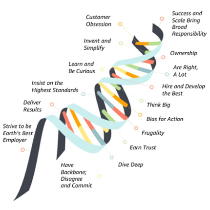

# ⭐AWS에 대해 알아보자⭐

강사님: **AWS Korea**에서 공공사업 담당하시는 **강상백** 강사님

AWS(Amazon Web Services)는 사실 추수감사절에 구매 사이트가 터지지 않게 하려고 만든것이 추수감사절 이전까지 사용이 안되서 기계가 놀고 있기 때문에 외부에 나가게 해서 기계가 놀지 않게 하려고 만들었다

## Leadership Principles
### 아마존을 아마존스럽게 만드는 아마존의 기업철학

아마존에서 가장 중요하게 생각하고 있다는 Customer Obsession(손님에게 집착해라)라고 한다 실제로 AWS등 다양한 아마존 서비스들이 손님이 사용하기 가장 편하게 개발 되고 있다고 한다

## Two Pizza team
**두개의 피자로 팀원의 한끼 식사를 할 수 있을 정도로 팀원을 짜라**

아마존이 생각하기에 가장 적당한 팀원이라고 생각하고 있다고 한다

소규모 팀원은 고객을 위한 혁신에 집중할 시간을 극대화 하여 직원 만족도를 높인다고 한다

## 2번째 시간
강사님: 으뜸정보기술 **김수종**님 클라우드 컨설팅을 전문분야로 하고 있슴

## CSP VS MSP
CSP는 클라우드 인프라를 제공하고 기본 플렛폼 서비스라면

MSP는 IT서비스를 대신 관리하는 회사

## 클라우드 컴퓨팅이란?
인터넷을 통해 서버, 스토리지, 데이터베이스, 네트워킹, 소프트웨어, 분석, 인텔리전스 등의 컴퓨터 서비스를 제공하는 것

## 클라우드 서비스 모델
IaaS,PaaS,SaaS 등 Iaas를 가장 많이 사용함

## AWS 핵심 서비스

- EC2
- S3
- RDS
- IAM

### Lambda
서버리스: 서버를 AWS에서 관리해주는 서비스 

## EC2 (Elastic Compute Cloud)
> 클라우드에서 안전하고 크기 조정이 가능한 컴퓨팅 용량을 제공하는 가상 서버 서비스

- 확장성: 몇 분만에 수천개의 인스턴스 시작 가능
- 성능: 다양한 인스턴스 유형으로 최적화된 성능
- 보안: VPC와 보안 그룹으로 네트워크 보안 제어
- 비용 효율성: 사용한 만큼만 지불하는 유연한 요금제

### Amazon EC2란?
Amazon Elastic Compute Cloud (EC2)는 클라우드에서 안전하고 크기 조정이 가능한 컴퓨팅 용량을 제공하는 웹 서비스입니다

#### EC2 인스턴스 패밀리
범용 <- 이거 중요

스팟 인스턴스 써라 님들이 놀고있는 서버를 최대 90% 할인 받아서 쓸 수 있음

## S3
> 업계 최고의 확장성, 데이터 가용성, 보안 및 성능을 제공하는 객체 스토리지 서비스
- 무제한 저장: 99.999999999%의 내구성으로 안전한 데이터 보관
- 보안: 암호화, 액세스 제어, 감사 기능 제공
- 성능: 전 세계 어디서나 빠른 액세스 가능
- 다양한 스토리지 클래스: 용도에 맞는 최적화된 스토리지 옵션

### S3 스토리지 클래스
데이터 액세스 패턴에 따른 최적화된 스토리지 옵션

지금 당장 알 필요 없다 생각하신다고 함

^^^나중에 알아보자

## AWS 데이터베이스 서비스
> 다양한 워크로드에 최적화된 완전 관리형 데이터베이스 서비스
- RDS: 관계형 데이터베이스 서비스
MySQL, PostgreSQL, Oracle 지원
- DynamoDB: NoSQL 데이터베이스 완전 관리형 키-값 데이터베이스
- ElastiCache: 인메모리 캐시 Redis와 Memcached 지원
하나는 Neptune인데 잘 안쓴다고 함

가장 많이 쓰는건 관계형 DB

캐싱 쓰는 이유 비용과 메모리 효율 아낄려고

사람들이 많이 쓰는거 기억했다가 db들어가지 않고 바로 뱉는거

## AWS 네트워킹 서비스
> 안전하고 확장 가능한 네트워크 인프라를 구축할 수 있는 서비스들

- VPC: 가상 프라이빗 클라우드 <- AWS 성장하게된 가장 큰 이유
  - 다 똑같은 아이피를 가지고 있는데 사실 아이피 주소가 다 다르다 

사설 아이피는 아래처럼 있는데
- 10.
- 172.
- 198.
VPC쓰면 장치에 저장된 것을 바탕으로 라우팅 해줌
 -더 공부할 듯-

## AWS 보안 원칙 <- 중요⭐⭐⭐⭐⭐

실수해서 800만원 털린 사랆 있음
2차인증 무조건 걸자
> AWS는 보안을 최우선으로 고려하여 다양한 보안 서비스와 모범 사례를 제공합니다

 

## AWS 보안 완전 가이드

고객이 설계 잘해서 기본적으로 막고 다른 것을 AWS에서 막아준다는 거 같음

- 전송 중 암호화: 암호화가 되서 읽을 수 없는 문자열로 나감

- 저장 중 암호화: 평문으로 저장되는 것이 아닌 읽을 수 없는 문자열로 저장하는 것

## AWS AI/ML 서비스
> 인공지능과 머신러닝을 누구나 쉽게 활용할 수 있는 다양한 서비스

서버리스 관심 있으면 읽어봐라

## Lambda (서버리스 컴퓨팅)
> 서버 관리 없이 코드를 실행할 수 있는 서버리스 컴퓨팅 서비스

이 외에도 다양한 것들이 있는데 그건 
[여기](https://cloud-burst-highschool-aws.vercel.app/) 여기 들어가서 봐라

## AWS 관련 직업
> 클라우드 기술의 확산으로 새롭게 주목받는 직업들

AWS 커리어 로드맵은 길라잡이로 써먹자

Specialty <- 이거 있으면 AWS에서 초대해줌 근데 3년에 한번씩 갱신해야하는데 마이 비쌈 ㅠㅠ

강사님이 생각하시는 AWS의 미래

**MCP는 나중에 공부 해보자**

- **완전 자동화의 장점**: 아이디어만 내면 클라우드가 해준다
- **완전 자동화의 단점**: 보안상 안전한지 모른다, 그리고 털리면 어디서 털렸는지 모른다

양자 보안 서비스는 이미 있는데 상용화 되진 않음 얼마 있지 않으면 양자 역학을 공부해야 할 수도 있음 존나 끔찍하농;;

AWS Tech Camp와 AWS Educate는 직접 함 써보슈 좋음

## AWS 따라하기(계정이 있다면 말이지)
일단 본인은 AWS 계정이 없다 일단 오늘 만들 예정이긴 하지만ㅋㅋㅋ

인터넷 뒤지다 보면 보긴함

1. 서버를 만들려면 vpc가 있어야 한다 모든 유저가 이 vpc를 통해서 같은 인터넷 사용 가능
2. vpc만 먼전 생성하고 다른 리소스도 직접 생성 해보는 것을 추천함 vpc등을 클릭하면 ec2올라오는 것만 기다리면 끝남
3. 아까 사용했던 ip대를 피해서 만듬 이해 못해도 된덴다
4. 리소스 4개만 사용한데
5. 오래걸리는 이유) 와이파이가 느려서 시발 학교야 와파좀 고쳐라 원래 5초도 안걸린데요
6. 상태가 활성화면 되는거인 듯
7. 리소스 앱이라고 잘 보이고
8. 보안쪽 봐서 어떻게 생성됬는지 보면됨
9. 아웃바운드 열어두면 존123나 크게 털릴 수 있음 카카오톡 사용하면 444만 열어 두는등 관리를 해주야함 인바운드는 특히 관리 해야함 
10. ec2생성하기 여기서 주의할 점 리전을 잘 보기 다른 리전 가서 생성하려 하면 생성 조차 안됌
11. 바로 인스턴스 생성한다 함 
12. 이름도 자유롭게 하면 됌
13. 쫌 존1234나 오래 걸림
14. 아마존 리눅스 사용한데 우분트 사용해도 된데 뭘 써도 상관ㅇ느 없데
15. 프리 티어 사용이라고 무료 사용가능함 
16. 키페어도 꼭 만들기 안만드면 접근 가능한 것ㅇ ㅣ하나 줄어듬 자동 다운됌
17. 네트워크 설정 -> 편집 눌러서 방금 만든 vpc 선택 -> 서브넷도 VPC와 함꼐 생성됨 VPC만 은 생성 안됌 만드는거 추천함 -> 공개 할꺼느까 퍼블릭 해서 할당 받음 -> 보안도 생성함 설명도 소마고 -> 아까 봤더 AC와 다른 보안 그룹이 뜸 -> 아까는 서브넷의 보안이라면 지금은 내 서버에 들어 올 수 있는 보안 이것도 2차 3차 보안이 있다면 그중 하나임 ssh사용해서 보안 할꺼임 -> 80포트 8080포트 열고 다음으로 넘어감 -> 스팟 인스턴스로 고급 인스턴스에 있음 스팟 인스턴스로 생성해보세요 대충 만들든 상관은 없는데 보여 주기 위해서 스팟 인스턴스로 만듬 -> 사용자 데이터는 서버가 만들어 질때 기본 설정 가능함 -> 테라폼 으로 코드로 만들 수 있음 클라우드 깊게 파고 들어갈 때 하면 됌 -> 이렇게 인스턴스 시작해봄
18. 요약으로 어떻게 만들어 질지 보임 이 아이피 주소는 그 아이피 대를 피한 사설 아이피임
19. 내도메인한국 <- 한글로 도매인 사용 가능함
20. 완성이 됬고 서버로 접속 해볼 꺼임 잘 모르겠으면 연결 눌러서 어케 접속하는지 보면 됌
21. 하지만 본인은 고급 인력이라서 모바일스텀을 사용해서 ssh로 들어갈 껀데 퍼블릭 아이피 복사해서 고급 인력이라도 아이디는 기억 안나서 그리고 아까 팸키를 다운 받았고 그걸로 접속 해봄 아마존 리눅스에 성공적으로 접속하면 새가 나오고 그리고 80포트와 8080포트를 열어놔서 그곳으로 접속을 해볼꺼임 접속하면 아무것도 없음 
22. 도커로 아파치 띄어 볼꺼임
23. 복붙 못하는 사람이 있으면 모르면 인설트 누르면 된데 그게 복붙임 
24. 리눅스는 글기만 해도 복사가됌 <- 개쩌농;;
25. 설치가 되면 80포트들어가면 it works! 뜸
26. 커스텀 인덱스 페이지 만든데
27. 명령어는 천천히 익숙해지면 되고
28. [이거](https://cloudrepo.kro.kr/AWS%20EDU/EC2%20Apache%20%EC%8B%A4%EC%8A%B5%20-%20%ED%8C%A8%ED%82%A4%EC%A7%80%20%EB%A7%A4%EB%8B%88%EC%A0%80%20vs%20Docker%20%EB%B9%84%EA%B5%90%20(Amazon%20Linux%20,%20Rocky%20Linux)/)가서 봐보셈 그럼 됌
29. 22번 포트로 접속 하고 있고 80포트로 띄우고 있다는 것을 볼 수 있음 페키지 메니저를 통해서 아파치를 띄움 도커를 통해서도 함 해보자
30. 도커: 내 컴퓨터에서 되는데 다른사람 컴에서는 안됌 그걸 다른 사람과 같은 환경을 공유하기 위해서 내 환경을 패키징 해서 공유하는 것을 쉽게 하기 위해서 나온게 doker임 걍 내 환경과 다른 사람의 환경을 일치시키기 위한 도구임 그렇게 알아 두셈
31. 도커를 안쓰는 움직임이 늘어나고 있는데 암튼 컨테이너를 쓰는건 맞음 ㅇㅇ 컨테이너 계넘은 알아두자
32. 도커를 이용해서 아파치를 실행해 볼껀데 80에는 올라가있음 그래서 80포트에 올리면 겹침 그래서 도커로 만든 아파치는 안만들어 져서 그 포트를 피해서 8080쓸꺼임 80은 서버의 아파치 8080은 포트의 아파치 퍼미션 디나인이 뜸 <- 나중에 알아보죠 이건 걍 권한 없데 권한있는 명령어 치레 힝구 그래서 root계정 씀 
33. 이제 8080에 아파치 올라가있는지 보죠
34. 올라 왔죠 이제 8080 들어가면 잇츠 워크 뜨고 80 들어가면 아파치 뭐시기 뜸
35. 이것도 보고 이미 인덱스 페이지 있는데 바꿀꺼냐 이건데 바꿀꺼고 이제 아파치 via 도커로 바뀜 한번 설명 해봄
36. vpc안에 섭브넷 안에 서버가 있는데 80으로 들어가면 패키지 메니져로 들어가고 docker에서 80으로 들어가면 서버 입장에서 8080으로 보임 그래서 공인으로 80으로 들어가면 서버로 띄우고 8080으로 들어가면 도커로 띄움
37. vpc subnet sever docker전부 보안을 설정함 docker에 들어갈 수 있는 계정과 각각 사용할 수 있는 계정또한 만들 수 있음
38. 제일 중요한거 한번 해본데
39. 클라우드 하면서 잊으면 안되는거 삭⭐제
40. 안쓰면 중지 또는 삭제 무조건 삭제해야함
41. 만든거 반대순서로 삭제한다고 생각하면 됌 삭제 하는데 약간의 시간이 들거임 마음이 급하면 vpc가서 대기하셈 ㅇㅇ 
42. 아까 vpc등으로 만들어 진것은 몇가지 리소스를 제외하고는 여기서 삭제 됌 나트게이트 같은건 직접 들어가서 삭제하면 됌 인스터스만 지워지면 여기서 삭제가 가능 
43. 아까 만들었던 거 다 삭제 가능함
44. 보면 실행중인 인스턴스가 사라짐
45. iam 담당자 내일 혼날듯
46. mfa가 빠져 있으면 여기 만드는 버튼이 뜰꺼임 
47. 핸드폰으로 mfa설정해서 로그인 할때마다 꼬박꼬박 해야함 귀찮아도 해야함 안그러면 800만원 털린다 시@불
48. 어떤 권한이 있는지도 다 볼수 있음
49. 나눠져 있는 데이터 센터가 존12나 많음
50. 코드로 나눠서 만들 수 있음 어떤 ima는 만들 수 있는 곳이 있고 실습 계정을 만들 때 설정을 해줌 
51. 그리고 아까 봤던 aws educate 공부를 먼저 하고 아 이제 내가 진짜 준비가 됬다 하면 100$쓰셈
52. 교육 프로그램도 있고 뭔가 되게 많음 
53. 어쏘를 합격 하면 프로 비용이 반으로 깍겨요 어쏘 따고 프로하면 돈을 아낀다 ai 관련한 자격증도 있고 보안 물어봤던 친구 시큐리티 뭐시기도 있고 디벨로퍼도 있고 데이터 엔지니어 클라우드 엔지니어 다 있음 데브옵스나 테스트 엔지니어 다 있음
54. 강의 자료는 편하게 가져다 써도 됌
55. 여담이지만 아까 말한 mcp써서 만든 거임
56. 무료로 클라우드 쓰러면 벌쎌 쓰면 됌
typescript 장점 많음 관계형 db쓰기 수월함

supabase baas라고 함 타입스크립트 써서 프론트 만들고 저걸로 db 맏기면 됌 eage function에서 supabase로 db에 넣음 supabase에서 배포는 vercel로 배포하면 됌 아까 저기도 vercel로 만듬

가장 중요한건 저 아키택쳐 전부 무⭐료임 클라우드 연습하기 정말 좋아요 저런 아키택쳐 이용해서 한번 해보기 사실 타입스크립트도 알아서 해줌 lovable로 맏기면 자동화 쌉@가능 전부 자동인데 무료임 와 개쩌네;;
ㅎㄷㄷ하네요 수파베이스에는 오브젝트 스토리지 있음 서버 없이 오브젝트 스토리지로 할 수 있음 이름이 뭐였지 암튼 그거도 무료임 저거 잘 활용하면 강사님 띄어넘는 개발자가 될 수 있다 라네요
클라우드 레포는 꾸준히 업데이트 하는중이레 저거 보면서 공부 하는것도 나쁘지 않음x