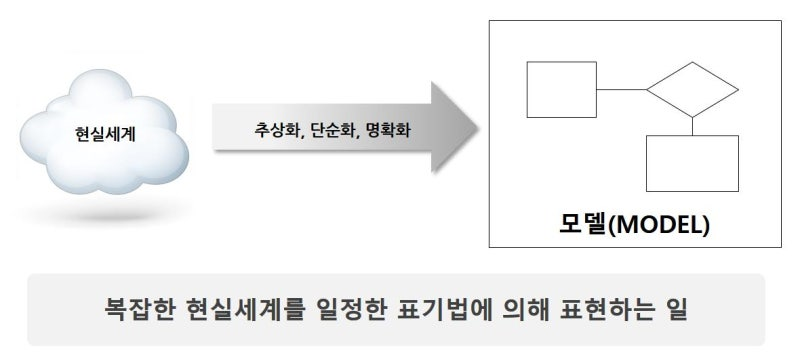

# 1. 데이터 모델리의 이해
## 1️⃣데이터 모델링의 개념 및 특징

**1. 데이터 모델링의 개념** 
데이터 모델링은 현실 세계에서 다루는 복잡한 데이터를 단순하고 이해하기 쉽게 표현하는 과정이다.
 이는 데이터를 저장, 관리, 활용하기 위한 설계도로 보면 된다.

한마디로 데이터 모델링은 **"복잡한 현실세계를 추상화ㆍ단순화ㆍ명확화하여 중요한 요소와 관계를 일정한 표기법에 의해 표현하는 것"** 이라고 정의할 수 있다

**2. 데이터 모델링의 특징** 
|추상화(Abstraction)|단순화(Simplification)|명확화(Clarification)|
|-------|------|-----|
| 1. 현실의 복잡한 데이터를 중요한 정보만 남기고 표현하는 과정  2. 불필요한 정보는 제외하고 필요한 데이터와 관계를 집중적으로 표현| 복잡한 데이터를 이해하기 쉬운 구조로 표현하는 방법| 데이터의 구조와 관계를 명확하게 표현하여 오해의 여지를 없애는 과정|
--------------------
### `확인문제 `
데이터 모델링의 **특징** 이 아닌 것은 
 ①. 일반화
 ②. 단순화
 ③. 명확화
 ④. 추상화 
| 정답 | ① 
| 해설 | 데이터의 모델링의 특징은 각각 단순화, 명확화, 추상화가 있다

위의 문제를 외우기 쉬운 방법:  
**`"단(순화)추(상화)구명(명확화)"`**으로 외우면 외우기 쉽다

**3. 데이터 모델링이 올바르게 수행되지 않는 경우**
| 중복성| 비유연성 | 비일관성 |
| ---- | ------- | -------- |
| 같은 데이터가 여러 곳에 저장되어 관리가 비효율적이고 불일치가 발생할 수 있음 | 데이터 모델이 변화에 대응하지 못해 시스템 확장이나 수정이 어려움 | 동일한 데이터가 다르게 저장되거나 표현되어 데이터의 신뢰성이 저하됨 |

## 2️⃣데이터 모델링의 관점
1. **데이터 관점(What)** 
데이터 모델링은 데이터 관점에서 모델링을 수행하는 것.
즉 **관리해야하는 데이터에 초점을 맞추어 관리하는 것이다**.  
**`예시`**: 수강 신청 과정에서 아이디, 학번, 비밀번호 등과 같은 데이터

2. **프로세스 관점(How)** 
데이터 관점과 달리 프로세스 관점은 데이터를 어떻게 처리할지에 초점을 맞추는 것. 
이는 **업무의 절차를 중심으로 데이터를 다루는 것이다.**  
**`예시`**: 수강 신청 과정 '아이디/비밀번호 입력 -> 수강 과목 선택 -> 수강 신청서 작성 -> 관리자 승인 -> 학생 수강 정보 저장' 과 같은 업무 절차에 중점을 두는 것이다

3. **데이터와 프로세스의 상관 관점(Interaction)** 
데이터와 프로세스의 상관 관점은 데이터와 프로세스가 서로 밀접하게 연결되어 있는 점을 강조하는 것.
 **데이터는 프로세스를 통해 의미를 얻고 프로세스는 데이터를 기반으로 실행된다** 

-----
**`확인 문제`** 
데이터 모델링의 관점에 대한 설명으로 가장 적절하지 않은 것은?
 ①. 데이터 관점은 '무엇(What)'에 초점을 두어, 데이터를 저장ㆍ관리하고 데이터 간 관계를 모델링한다.
 ②. 프로세스 관점은 '어떻게(How)' 처리할지를 중시하여 업무 흐름과 절차를 모델링한다.
 ③. 데이터와 프로세스의 상관 관점은 데이터와 프로세스가 서로 영향을 주고받는 상화 의존 관계를 강조한다
 ④. 프로세스 관점은 데이터 자체에만 관심을 자미녀, 데이터 간의  단순화하여 표현한다. 
| 정답 | ④ 
| 해설 | 데이터 자체에만 관심을 가지는 것이 아닌 업무의 절자와 흐름에 초점을 맞춘다.