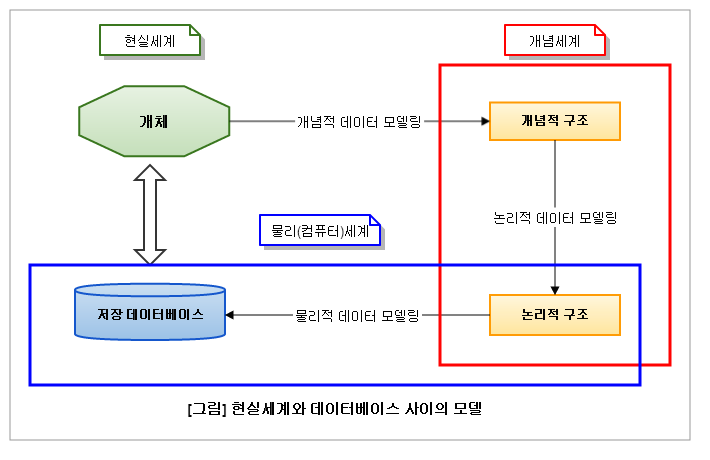

# 1. 데이터 모델링의 이해
## 3️⃣데이터 모델링의 3단계
1. 데이터 모델링은 현실세계에서 데이터를 추상화 한 후 개념 세계에서 구조화 한 뒤, 이를 기반으로 물리세계에서 구현하는 일련의 과정이다. 
각 단계의 데이터 모델링을 수행함으로써 설계된다.

#### (1). 개념적 데이터 모델링
현실 세계의 데이터를 추상화 하여 개념적 구조를 설계한다

#### (2). 논리적 데이터 모델링
개념적 구조를 바탕으로 논리적 단계와 데이터 속성을 정의 하고 논리적 구조를 설계한다

#### (3). 물리적 데이터 모델링
논리적 기반을 바탕으로 물리적 구조를 설계한다

2. 한편 물리적 구조(저장 데이터베이스)와 논리적 구조를 합쳐서 물리(컴퓨터)세계라 하고 개념적 구조와 논리적 구조를 합쳐서 개념 세게라고 한다

#### (1). 개념세계
개념적 구조와 논리적 구조를 포함하며, 사람이 이해 할 수 있는 논리적 흐름과 관계를 설명하는 것이라고 한다

#### (2). 물리세계
논리적 구조와 물리적 구조를(저장 데이터베이스)를 포함하며, 컴퓨터가 데이터를 저장하고 처리하는 구체적인 방식을 다룬다

### 학계와 산업계의 구분 차이
개념적ㆍ논리적ㆍ물리적 구조의 구분은 학계와 산업계에서 다소 차이가 있다. 
공식적으로 정의한 기준은 없으나, 본서에서는 일반적인 기준에서 학계와 산업계의 차이를 다음과 같이 구분한다 
| 구분 | 학계 | 산업계 |
| ---- | --- | ------ |
| 개요 | - 개념적/논리적 모델링을 명확히 구분  - 논리적 모델링에서 데이터를 도출 | - 개념적/논리적 모델링을 명확히 구분하지 않음  - 물리적 모델링에서 테이블 도출 | 
| 개념적 모델링 | - ERD 도출   - 주로 chen 타입의 ERD 사용   - 관계가 자체 속성을 가질 수 있음 | - 개념적/논리적 모델링을 명확히 구분하지 않음  - 물리적 모델리에서 테이블 도출 |
| 개념적 모델링 | - ERD 도출  - 주로 Chen 타입의 ERD 사용   - 관계가 자체 속성을 가질 수 있음 | - 핵심 엔터티/관계/속성 중심 ERD 도출  - 추상화 수준이 높고 업무 중심적인 포괄적 모델링  - 주로 IE/Crow's Foot 타입의 ERD 사용  - M:N관계 해소|
| 물리적 모델링 | - 실제 DBMS에 맞는 테이블 구축   - 데이터 타입 정의, 인덱스 설계, 뷰 설계 | - 테이블 도출(기본 키, 외래 키, 칼럼 정의)  - 정규화 및 반정규화 수행  - 데이터 타입 정의, 인덱스 설계, 뷰 설계| 
 