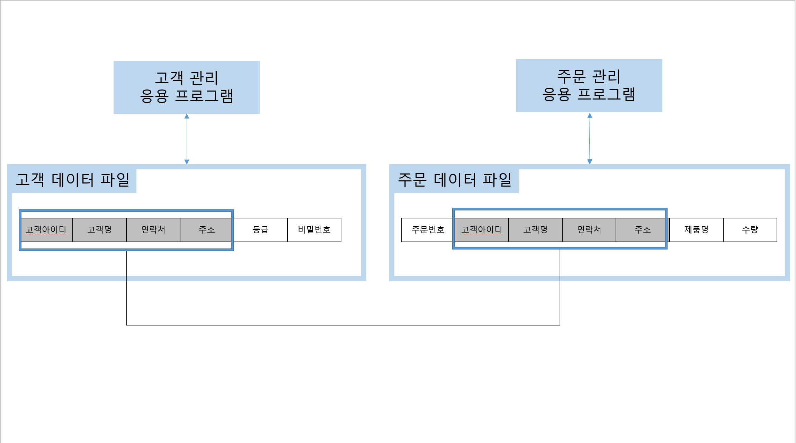

# 1. 데이터 모델리의 이해
## 4️⃣데이터 독립성
데이터 독립성은 데이터와 응용 프로그램을 분리하여 설계 및 관리 효율을 높이는 것이다 
이름 이해하기 위해서는 데이터베이스 시스템 이전의 **'파일 시스템'** 에 대한 이해가 필요하다

**1. 파일 시스템의 구조와 문제점**
과거에는 데이터를 관리하기 위해서 파일 시스템을 사용했다 아래의 그림과 같이 파일 시스템에서는 각 프로그램별로 필요한 데이터를 개별 파일로 관리했기 때문에 **데이터 중복 관리** 및 **데이터 불일치**라는 문제가 생겼다

**(1). 데이터 중복 관리** 
고객 데이터가 파일과 주문 데이터 파일에 동일한 데이터가 중복 저장된다. 
**(2). 데이터 불일치** 
주문 데이터 파일에서는 고객의 연락처가 수정 되었지만, 주고객 데이터 파일에서는 해당 데이터가 수정되지 않고 그대로 남아있는 경우가 존재할 수 있다

**2. 데이터베이스 시스템** 
파일 시스템과 달리 데이터베이스 시스템은 데이터의 중복 관리를 제거하고, 데이터 일관성을 유지하며, 효율적으로 데이터를 공유하기 위해 설계된 시스템이다.
 
**(1). 데이터의 통합 관리** 
동일한 데이터를 중복 관리하지 않고, 하나의 데이터베이스에서 통합 관리 한다. 
**(2). 데이터 공유와 일관성 유지** 
데이터베이스에 저장된 데이터를 여러 프로그램이 공유하여 사용하므로 데이터가 일관성을 유지 할 수 있다