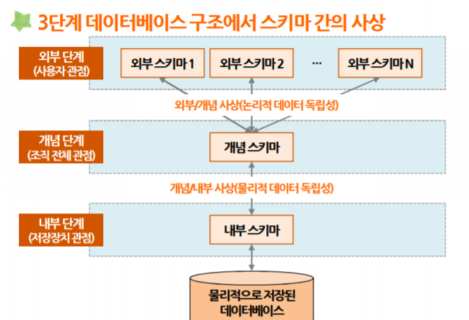
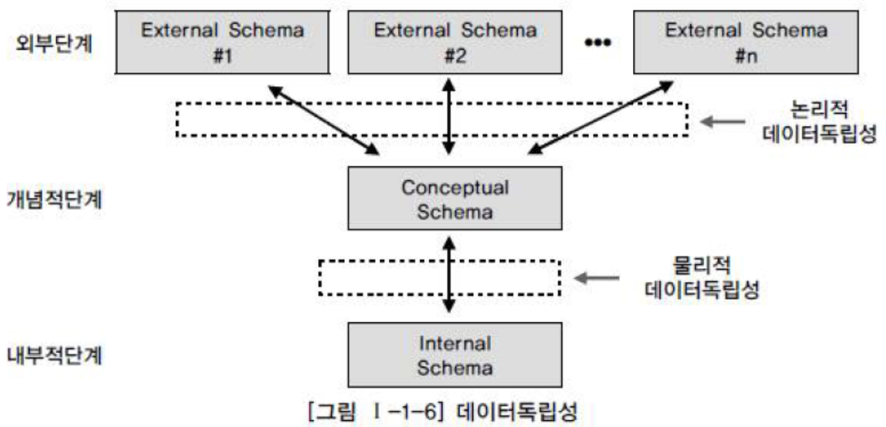

# 1. 데이터 모델리의 이해
## 5️⃣데이터베이스의 3단계 구조
스키마는 데이터베이스를 바라보는 여러 관점에서 데이터를 표현하는 방식이다.
 스키마는 여러가지 스키마가 있는데
- 외부 스키마
- 개념 스키마
- 내부 스키마
위와 같이 총 3가지의 스키마로 나뉜다
 

**1. 외부 스키마(External Schema)** 
외부 스키마는 응용 프로그램이나 사용자 관점에서 데이터를 표현한 것.  
**예시)** '내 급여는 얼마인가', '부서 간 평균 급여 차이'과 같은 형태로 데이터를 보여준다
 

**2. 개념 스키마(Conceptual Schema)** 
개념 스키마는 외부 스키마에서 요구된 모든 데이터를 통합하여 설계한 데이터를 논리적으로 나타낸다.
 이는 외부 스키마가 필요로 하는 데이터를 모아 데이터 간의 관계를 정의한 것이다.  
**예시)** 세 개의 외부 스키마에서 필요로 하는 데이터 'a, b, c', 'b, c, d', 'd, e, f'를 개념 스키마에서 데이터를 통합해 'a, b, c, d, e, f'모두를 사용하기 위한 구조를 다룬다. 

**3. 내부 스키마(Internal Schema)** 
내부 스키마는 개념 스키마를 물리적으로 저장한다. 데이터가 실제로 저장되는 방식과 최적화된 데이터베이스 구조를 포함한다

-----------
### `확인 문제`
**외부 스키마에 대한 설명으로 가장 적절하지 않은 것은?** 
①. 응용 프로그램 또는 사용자 관점에서 데이터를 표현한다. 
②. '내 급여는 얼마인가?'와 같이 특정 사용자가 필요로 하는 데이터 뷰를 제공한다.  
③. 개념 스키마를 물리적으로 저장하는 구조를 나타낸다. 
④. 개별 사용자나 프로그램마다 다른 형태로 데이터가 표현 될 수 있다. 
**`| 정답 |`  ③ **
**`| 해설 |` 개념 스키마를 물리적으로 구현하는 저장 구조를 정의하는 것을 내부 스키마이다**

## 6️⃣데이터의 종속성과 독립성
**1. 데이터 종속성** 
데이터 종속성은 데이터 간의 상호 의존 관계를 의미하는 것으로, 주로 '파일 시스템'에서 발생하는 문제이다.

**2. 데이터 독립성** 
데이터 독립성은 데이터 구조에서 변경이 응용 프로그램에 영향을 주지 않는 특성을 의미한다.

> `논리적 독립성`
> - 논리적 사상을 통해 논리적 독립성이 보장됨
> - 개념 스키마(논리적인 구조)가 변경되어도 외부 스키마(응용 프로그램)가 영향을 받지 않음

> `물리적 독립성`
> - 물리적 사상(개념적/ 내부적 사상)을 통해 물리적 독립성을 보장함
> - 내부 스키마(데이터 저장 방식 및 물리적 구조)가 변경되어도 개념 스키마가 영향을 받지 않음

**3. 데이터 독립성이 유지되지 않는 경우** 
①. 데이터 중복성과 복잡도가 증가한다. 동일한 데이터가 여러 프로그램과 파일에 중복으로 관리 되면서 데이터 불일치 문제가 발생할 수 있다. 
②. 요구사항에 대응하는 난이도가 증가하여 데이터 유지보수 비용이 상승한다.