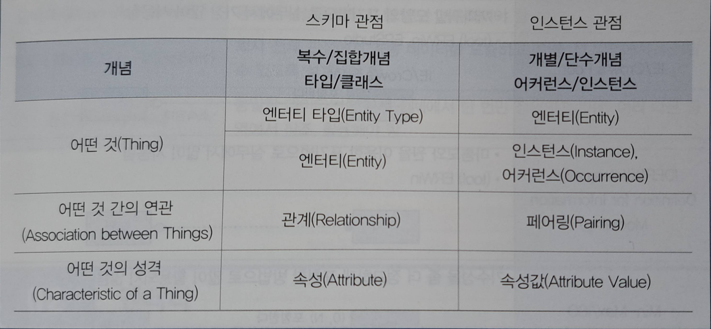
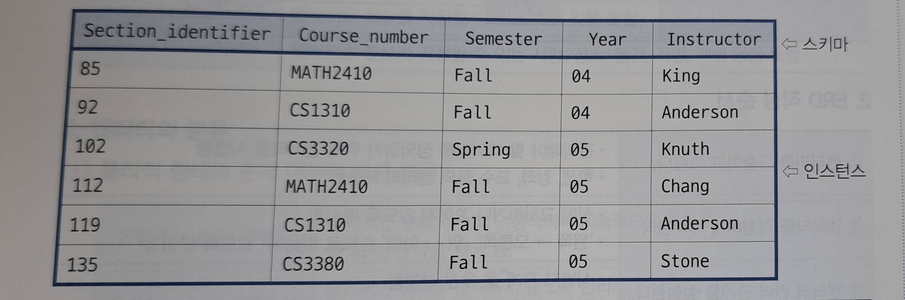
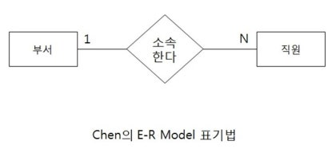
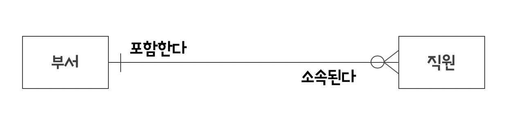
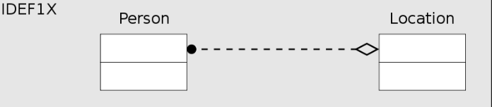
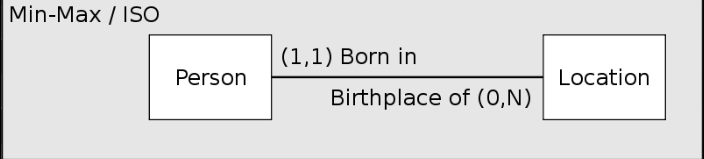
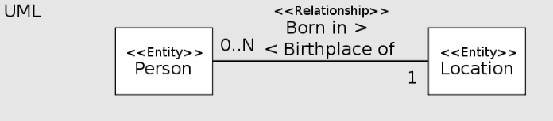
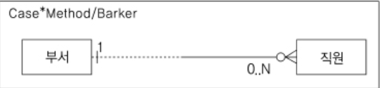

# 1. 데이터 모델리의 이해
## 7️⃣데이터 모델링의 요소
**1. 데이터 모델링의 3가지 구성요소**
> **`엔티티(entity)`**: 업무에서 관리해야 할 개체 또는 대상(Thing)을 의미.  
> 
> **`속성(Attribute)`**: 엔티티가 가지는 특성이나 정보 
>
> **`관계(Relationship)`**: 엔티티 간의 연결 또는 상호작용

데이터 모델링에서는 현실 세계의 대상을 정형화하여 데이터베이스에 표현하기 위해 다양한 개념과 용어를 사용한다. 이에 따라 스키마 관점과 인스턴스 관점에서 사용되는 주요 용어들을 위와 같이 정리 할 수 있다.

**2. 스키마(Schema) vs 인스턴스(Instance)** 
스키마는 데이터베이스의 구조와 설계를 정의한 것이고 인스턴스는 스키마에 따라 특정 시점에 저장된 실제 데이터를 의미한다

> ## 스키마 
> - 데이터 모델링의 대상
> - 데이터베이스의 구조, 데이터 타입, 그리고 제약 조건에 대한 명세
> - 데이터베이스 설계 단계에서 명시되며, 자주 변경되지 않음

> ## 인스턴스
> - 특정 시점에 데이터베이스에 실제로 저장되어 있는 데이터
> - 자주 변경됨

## 8️⃣데이터 모델 표기법 및 ERD 작성 순서
**1. 데이터 모델 표기법**
> ## Peter Chen
> - 대학에서 가장 많이 사용하는 표기법
> - 실무에서 거의 사용하지 않음
> 

> ## IE/Crow's Foot
> - 까마귀발 모양의 표기법으로 실무에서 가장 많이 사용하는 표기법
> - (tool) ERWin, ERStudio
> 

> ## IDEF1X(Intergration Definition for Information Modeling)
> - 마름모와 원을 이용한 표기법으로 실무에서 많이 사용한다
> - (tool) ERWin
> 

> ## Min-Max/ISO
> 기수성을 좀 더 정교하게 표현한 방법으로 많이 사용하진 않는다
> 

> ## UML
> - 데이터 모델링과 프로세스 모델링을 동시에 다룸
> - (tool) Rational Rose
> 

> ## Case Method / Barker's Notation
> - Crow's Foot과 유사, 관계 표기법 등 일부 다름
> - (tool) DA#
> 

**2. ERD 작성 순서**
> **①** 엔티티를 도출하고 그린다.
> - 관리해야 할 데이터를 정의하기 위해 엔티티를 식별함
> - 학생, 강좌, 교수 등의 엔터티 도출함
>
> **②** 엔티티를 적절하게 배치한다.
> - 선이 교차하거나 꼬이지 않도록 배치함
> - 왼쪽 -> 오른쪽, 위 -> 아래 순으로 읽을 수 있도록 구성함
>
> **③** 엔티티 간의 관계를 설정한다
> - 식별자 관계를 우선 설정함
> - Cycle 관계(순환 관계)가 발생하지 않도록 주의함
>
> **④** 관계명을 서술한다(양 방향).
> - 관계명은 현재형으로 작성하며, 지나치게 포관적인 단어는 피함
> - 실제 프로젝트에서는 관계명 자체를 크게 중요하게 다루지 않는 경우도 있음
>
> **⑤** 관계 참여도를 표현한다
> - 한개의 엔티티와 다른 엔티티 간 참여하는 관계 수를 의미함
> - **`예`** 1:1, 1:N, N:M 관계
>
> **⑥** 관계의 필수 여부를 확인한다
> - 필수 관계와 선택 관계를 명시함

**3. 좋은 데이터 모델의 요건**
> ## 완전성(Completeness)
> 업무에서 필요로 하는 모든 데이터가 데이터 모델에 정의되어야 함

> ## 업무 규칙(Business Rules)
> 업무규칙을 반영하기 위해 필요한 데이터가 데이터 모델에 표현되어야 함

> ## 중복배제(Non-Redundancy)
> 동일한 사실은 반드시 한 번만 기록하여야 함

> ## 데이터 재사용(Data Reusability)
> 회사 전체 관점에서 공통 데이터를 도출하고, 이를 전 영역에서 사용할 수 있도록 설계해야함

> ## 통합성(Integration)
> 동일한 데이터는 조직의 전체에서 한 번만 정의되고, 이를 여러 다른 영역에서 참조/활용 해야함

# 2. 엔티티
## 1️⃣엔티티(Entity)의 개념
**1. 엔티티의 정의** 
엔티티란 '업무에 필요한 정보를 저장하고 관리하기 위한 집합적인 것'으로 정의 할 수 있다.

여러 학자들은 각자의 관점에서 엔티티를 다음과 같이 정의하고 있다
> Peter Chen: 엔티티란 변별할 수 있는 사물을 뜻함 
> C.J. Date: 엔티티란 데이터베이스 내에서 변별 가능한 객체를 뜻함 
> James Martin: 엔티티란 정보를 저장할 수 있는 어떤 것을 뜻함 
> Thomas Bruce: 엔티티란 정보가 저장될 수 있는 사람, 장소, 물건, 사건, 개념 등을 뜻함

**2. 엔티티의 분류** 
(1). 물리적 형태의 존재 여부에 따른 분류
> ## 유형(Tangible) 엔티티
> 물리적인 형태가 있고 안정적이며 지속적으로 활용함
>
> ## 개념(Conceptual) 엔티티
> 물리적인 형태는 존재하지 않으나 관리해야 할 개념적 정보
>
> ## 사건(Event) 엔티티
> 업무 수행 과정에서 발생하며 비교적 발생량이 많음

(2). 발생시점 및 상속 관계에 따른 분류
> ## 기본(Fundamental) 엔티티
> 다른 엔티티로부터 영향을 받지 않고 독립적으로 생성되며, 스스로 주식별자를 갖는 엔티티
>
> ## 중심(Main) 엔티티
> 기본 에티티로부터 주식별자를 상속받아 생성되며 주로 업무의 핵심적인 데이터를 관리하는 엔티티
>
> ## 행위(Active) 엔티티
> - 특정 사건이나 활동의 결과로 생성되는 데이터
> - 두 개 이상의 엔티티간 관계를 통해 데이터가 생성됨