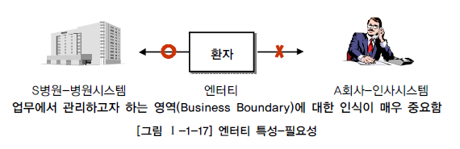
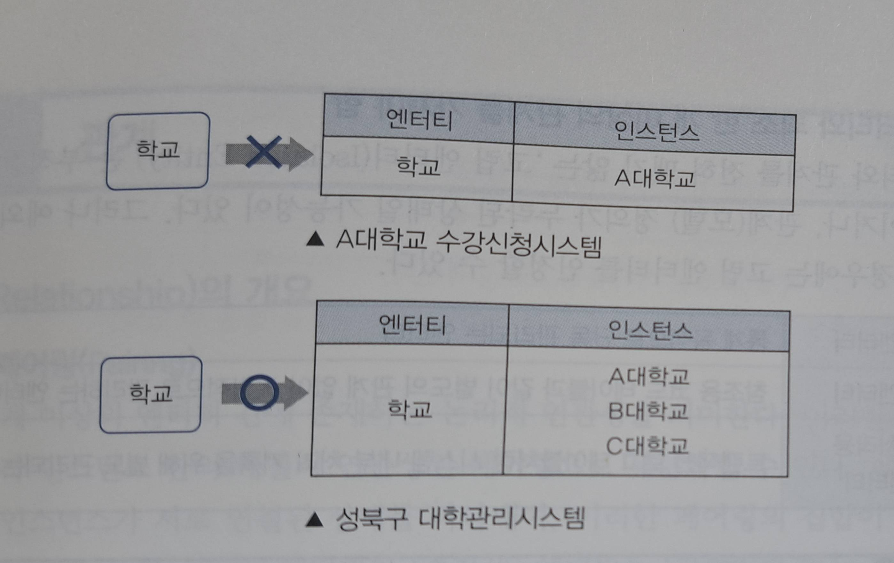

# 2. 엔티티
**3. 엔티티와 인스턴스** 
엔티티는 데이터베이스에서 관리하려는 객체이고 인스턴스는 엔티티 바탕으로 생성 된 개별 객체이다. 
> 예를 들어 설명하자면 **데이터베이스**는 **도시**이고
**엔티티**는 **도시의 건물 종류**이고 **인스턴스**는 **실제 개별 건물**이라고 설명 할 수 있을 것 같다

## 2️⃣엔티티의 특징
**1. 엔티티는 해당 업무에서 관리할 필요가 있는 정보를 포함해야함** 
어떤 정보가 엔티티로 포함될지는 조직의 관심 영역과 필요에 따라 결정 되므로 엔티티는 해당 업무에 관리할 필요가 있는 정보여야 한다.

**2. 유일한 식별자에 의하여 식별이 가능해야함** 
엔티티는 반드시 하나 이상의 주식별자(Primary key, PK)를 가져야 한다.
> ### Primary key(PK)란?
> 엔티티의 여러 인스턴스중 단 하나를 명확하게 식별 할 수 있는 속성을 의미한다  
> PK의 특징으로는 다음 과 같다
> - 모든 레코드가 서로 다른 값을 가져야 한다.
> - NULL값을 가지고 있을 수 없다.
> - 레코드의 값은 서로 같을 수 없다

예를 들자면 `학생` 엔티티에 수 많은 인스턴스를 가지고 있더라도 이들 중 동일한 `학번`을 가지는 경우는 없음으로 `학번`은 `학생`의 `주식별자`이다

**3. 영속적으로 존재하는 다수의 인스턴스의 집합이여야 함** 
엔티티는 일시적으로 존재하는 인스턴스를 다루는 것이 아닌 장기간 유지되는 영속적인 자료를 다룬다 또한 하나의 엔티티는 하나의 인스턴스가 아닌 둘 이상의 인스턴스의 집합을 가진다.

**4. 업무 프로세스에 의하여 이용되어야함(CRUD 연산 발생)** 
엔티티는 업무 흐름(프로세스)과 밀접하게 연관되여야 하며, 실제 업무 상황에서 생성(Create), 조회(Read), 갱신(Update), 삭제(Delete)와 같은 CRUD 연산 중 최소한 한 가지의 연산에 관여해야 한다.

**5. 반드시 속성을 가져야 함** 
속성은 엔티티가 담고 있는 구체적인 데이터 요소를 표현하는 최소의 단위이다.
 예를 들자면 `학생`엔티티는 `학번`, `이름`, `전공`, `연락처`와 같은 속성들을 포함한다.

**6. 주식별자만 존재하고 일반 속성은 없는 경우는 바람직하지 않음**
엔티티는 구체적인 정보를 관리하기 위해 존재한다 하지만 주식별자만 존재하고 일반 속성은 없는 경우에는 해당 엔티티는 실제 업무에서 거의 황용 가치가 없다고 할 수 있다.

**7. 다른 엔티티와 최소 한 개 이상의 관계를 가져야 함** 
다른 엔티티와 관계를 전혀 맺지 않는 '고립 엔티티(Isolated Entity)'는 부적절하게 도출된 엔티티이거나, 관계(모델) 정의가 누락된 상태일 가능성이 크다. 하지만 다음과 같은 예외 상황이 있다

- `통계성 엔티티`: 통계 목적으로 단독 관리되는 엔티티
- `코드성 엔티티`: 참조용 코드 테이블과 같이 별도의 관계 없이 독립적으로 관리하는 엔티티
- `시스템 처리용 내부 엔티티`: 트랜잭션 로그 테이블처럼 시스템 내부 처리 기록을 위해 별도 관리되는 엔티티

-------------
### 확인문제
엔티티에 대한 특징으로 가장 적절하지 않은 것은? **①.** 업무에서 관리할 필요가 있는 정보여야 한다. 
**②.** 유일한 식별자(PK)로 식별 가능해야 한다. **③.** 하나의 엔티티는 단 하나의 인스턴스만 가질 수 있다. 
**④.** CRUD 연산을 통해 실제 업무 프로세스에서 활용되어야 한다. 
| 정답 | **③**
| 해설 | 엔티티 하나는 적어도 둘 이상의 인스턴스 집합을 관리하는 개념이다

## 3️⃣엔티티의 명명 원칙
**1.** 엔티티 생성 의미대로, 실제 업무에서 사용하는 용어를 사용한다.
**2.** 약어를 가급적 사용하지 않는다.
**3.** 단수 명사를 사용한다.
**4.** 이름이 동일한 엔티티가 중복으로 존재할 수 없다.

-----------
### 확인문제
엔티티명으로 가장 적절한 것은?
 **①.** EMP 
**②.** Employees 
**③.** 회사 정보 
**④.** Student 
| 정답 | ④ 
| 해설 | `1. 약어를 가급적 사용하지 않는다` 
`2. 단수명사를 사용해야 한다` 
`3. '회사정보'는 구체적인 업무 용어라기보다는 추상적이고 포괄적인 표현이다.`
