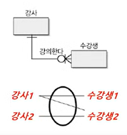
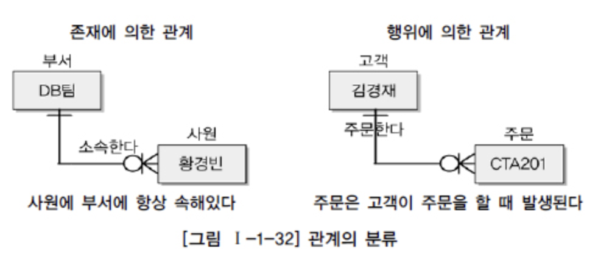
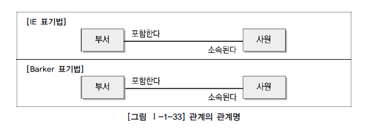
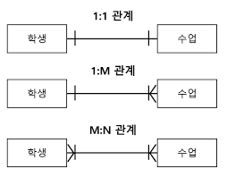
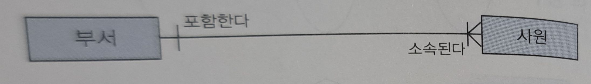
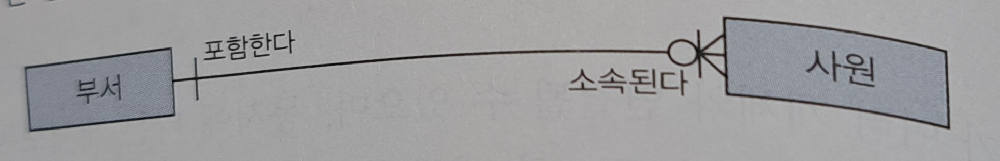
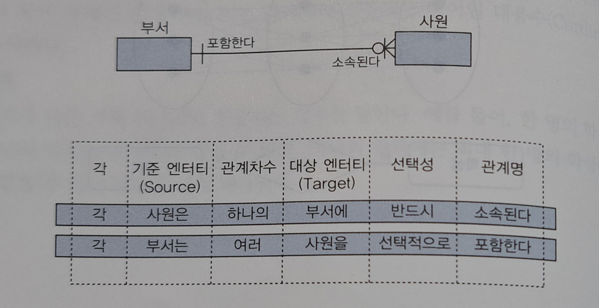

# 3. 관계
## 1️⃣관계(Relationship)의 개요
**1. 관계와 페어링(Pairing)**<br>
관계는 두 개 이상의 엔티티 간에 존재하는 논리적인 연관성을 의미한다 이러한 관계는 엔티티 내의 각 인스턴스 간의 개별적 연관성인 페어링으로 세분화 될 수 있다

페어링은 두 개 이상의 인스턴스가 서로 연결된 상태를 나타내며, 이러한 페어링의 집합이 관계를 구상하게 된다

<br>
**2. 관계의 분류**<br>
(1) 존재에 의한 관계<br>
존재 자체로 엔티티 간 연광성을 형성되는 관계를 나타낸다

(2) 행위에 의한 관계<br>
특정한 업무 수행이나 이벤트 발생을 통해 엔티티 간 연광성이 형성되는 관계를 나타낸다


> ### 확인문제
> **관계에 대한 설명으로 가장 적절하지 않은 것은?**
> ```
> - 학생은 반드시 학부생 또는 대학원생으로 등록된다.
> 등록 후 학부생 또는 대학원생으로 수강 신청을 통해 수업을 들을 수 있다.
> ```
> **①.** 관계는 존재적 관계와 행위에 의한 관계로 나누어 볼 수 있다<br>
> **②.** 학생과 수업 엔티티 간의 '수강' 관계는 행위에 의한 관계이다<br>
> **③.** 학부생과 대학원생 엔티티는 상호배타적 관계이다.<br>
> **④.** 학생과 학부생 또는 대학원생의 관계는 행위에 의한 관계로 볼 수 있다.<br>
> `| 정답 |` ④<br>
> `| 해설 |` 학생과 학부생 또는 대학원생의 관계는 상위 개념에서 파생된 하위 개념 간의 관계로 이는 존재적 관계이다

## 2️⃣관계의 표기법
**1. 관계명(Relationship Memvership)**<br>
관계는 두 방향 모두에서 관계명을 가진다

> ### 관계명 명명 원칙
> - 애매하거나 의미가 모호한 동사로 표기 하지 않는다
> - 관계명은 현재형으로 표현하거나 과거 혹은 미래형으로 표기하지 않는다
> - 바람직한 관계명: '신청한다', '포함한다', '관리한다'

**2. 관계 차수(Degree)**<br>
관계 차수는 관계를 통해 엔티티 간 참조 가능한 인스턴스 수를 의미한다 일반적으로 `1:1`, `1:N`, `N:M`등의 형태가 존재한다

**(1) 1:1 관계**<br>
한 개체가 다른 개체 하나와만 연결되는 경우를 말한다

**(2) 1:N 관계(또는 N:1)**<br>
한 개체가 여러 개체와 연결 될 수 있는 경우를 말한다

**(3) N:M 관계**<br>
하나의 개체가 여러 개체와 연결 될 수 있으며 동시에 다른 개체도 여러 개체와 연결 될 수 있는 관계이다



**3. 관계 선택성(Optionality)**<br>
관계 선택성은 관계 참여가 필수 인지 여부를 물어본다<br>

**①. 필수 참여(Mandatory Membership)**<br>
관계 형성 시 한 쪽 엔티티와 인스턴스에 대응되는 인스턴스가 반대편 엔티티에 반드시 존재해야 함을 의미한다


**②. 선택 참여(Optional Membership)**<br>
관계 형성 시 한 쪽 엔티티의 인스턴스에 대응되는 인스턴스가 반대편 엔티티에 하나도 존재하지 않아도 무방함을 의미한다


만약 양쪽이 모두 Optional로 설정 되어 있다면 해당 관계의 필요성을 다시 검토 해야한다.

이는 관계 자체가 잘못 설정되었거나 업무 요구 사항이 명확히 정의되지 않는 상황일 가능성이 있기 때문이다

**4. 관계 일기**
