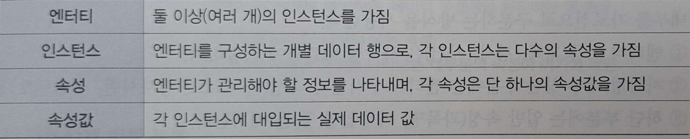

# 4. 속성
## 1️⃣ 속성(Attribute)의 개요
### 1. 속성의 정의
속성은 엔티티를 구성하는 가장 기본적인 정보 단위로, 엔티티의 고유한 특징과 성질을 구체화 하는데 사용된다

**(1) 엔티티의 특징 혹은 본직적 성질** 
속석은 엔티티가 무엇인지와 어떤 성격을 가지는지를 명확히 표현하는 요소이다

**(2) 의미상 더 이상 분리되지 않는 최소의 데이터 단위** 
속성은 논리적으로 더 쪼갤 수 없는 최소 단위의 정보이다

**(3) 엔티티 인스턴스의 성격을 구체화** 
속성은 엔티티에 속한 각 인스턴스 각각에 대해 구체적인 특징을 부여한다

**(4) 엔티티, 인스턴스, 속성, 속성값 간의 대응 관계** 

> ### 확인문제
> **속성에 대한 설명으로 가장 적절한 것은?** 
> **①.** 속성은 엔티티를 논리적으로 쪼갤 수 있는 최대 단위의 데이터이다. 
> **②.** 속성값은 하나의 속성에 대해 여러 개의 값을 가질 수 있다. 
> **③.** 속성이 없다면 엔티티를 구체화하거나 실체화하기 어렵다. 
> **④.** 속성은 반드시 주식별자 역활을 수행해야 한다. 
> `| 정답 |` **③** 
> `| 해설 |` 1. 속성은 엔티티를 논리적으로 쪼갤 수 있는 최소 단위의 정보다 
> 2. 속성은 하나의 속성값만을 가진다 
> 4. 모든 속성이 주식별자 역활을 하는 것은 아니다.

### 2. 속성의 특징
1. 속성은 해당 업무에서 반드시 관리해야 할 의미가 있는 정보를 표현해야 한다.
2. 모든 속성은 엔티티의 주식별자에 함수적으로 종속되어야 한다.
3. 하나의 속성은 단 하나의 값을 가져야 한다

## 2️⃣속성의 표기
### 1. 속성의 명명 원칙
**①.** 속성명은 업무 현장에서 실제로 사용하는 용어를 기반으로 부여한다. 
**②.** 약어의 사용은 의미 전달에 혼동을 줄 수 있으므로 가능하면 지양한다. 
**③.** '~하는' 등의 서술적 표현 대신 명사형을 사용하여 속성명을 간결하고 명확하게 표현한다 
**④.** '~의', '~에 대한' 등의 수식어와 소유격 표현은 피한다. 
**⑤.** 속성명은 가능한 한 전체 데이터 모델 내에서 유일하게 정의한다.