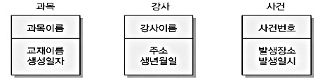

# 04. 속성
### 2. 속성의 표기
IE(Information Engineering) 표기법에서는 엔티티를 사각형으로 표현하고 그 사각형 내부를 가로선으로 구분하는 방식을 사용한다

1. 엔티티의 이름은 사각형 외부에 기술하며
2. 사각형 내부 상단 부분에는 엔티티의 식별자을,
3. 하단 부분에는 일반 속성을 배치한다

## 3️⃣속성의 도메인(Domain)
1. 도메인은 각 속성이 가질 수 있는 값의 범위와 유형을 정의하는 개념으로, 속성에 입력 될 수 있는 데이터의 타입, 길이, 허용 범위, 제약 사항 등을 규정한다
2. 도메인을 적절히 설정하면 잘못된 값이 입력되는 상황을 사전에 차단할 수 있으며 데이터베이스 설계와 유지보수에 있어 안전성을 높여 준다

## 4️⃣속성의 분류
### 1. 속성의 특성에 따른 분류


### 2. 엔터티 구성 방식에 따른 분류
> #### PK(Primary Key)
> - 엔티티의 각 인스턴스를 유일하게 식별할 수 있는 속성
> - 반드시 존재하며, 중복될 수 없음
> #### FK(Foreign Key)
> - 다른 엔티티의 PK를 참조하는 속성
> - 엔티티 간 관계를 형성하며, 데이터 무결성을 유지하는 데 중요
> #### 일반 속성
> - PK,FK를 제외한 나머지 모든 속성
> - 엔티티의 특징과 정보를 나타내는 대부분의 속성이 여기에 해당

### 3. 분리 가능성에 따른 분류
> #### 복합 속성(Composite Attribute)
> - 하나의 속성이 의미적으로 분해 가능한 하위 속성들로 구성
> #### 단순 속성(Simple Atrribute)
> - 더 이상 분해할 수 없는 원자적 속성

### 4. 속성갑의 수에 따른 분류
> #### 다중값 속성(Multi-Valued Attribute)
> - 하나의 속성이 여러 값을 동시에 가질 수 있는 경우
> 데이터 정규화 관점에서 별도 엔티티 분리가 권잔됨
> #### 단일값 속성(Single-Valued Attribute)
> - 하나의 속성이 하나의 값을 갖는 경우

# 05. 식별자
## 1️⃣식별자(Identifier)의 개요
### 1. 식별자의 정의
식별자란 데이터 모델링에서 각 엔티티 내의 개별 데이터를 고유하게 구별할 수 있는 속성을 의미한다

식별자는 데이터의 무결성과 일관성을 유지하는 데 필수적이며 주로 기본키로 활용됨

### 2. 식별자의 분류
> ### 대표성
> > #### 주식별자
> > - 엔티티 내에서 각 인스터스를 구분할 수 있음
> > - 타 엔티티와 참조 관계를 연결할 수 있음(Primary Key에 해당함)
> > #### 보조식별자
> > - 엔티티 내에서 각 인스턴스를 구분할 수 있음
> > - 대표성을 갖지 못해 참조 관계 연결에 사용되지 않음(Candidate Key에 해당)
> ### 목적
> > #### 내부식별자
> > - 엔티티 내부에서 스스로 만들어지는 식별자
> > #### 외부식별자
> > - 관계를 통해 유입되는 타 엔티티의 식별자(Foreign Key에 해당)
> > - 주식별자 속성 또는 일반 속성으로 포함될 수 있음
> ### 속성수
> > #### 단일식별자
> > - 하나의 속성으로 구별된 식별자
> > #### 복합식별자
> > - 둘 이상의 속성으로 구성된 식별자
> ### 본질
> > #### 본질식별자 
> > - 업무상 이미 존재하는 속성으로 만들어진 식별자
> > #### 인조 식별자
> > - 데이터베이스 설계 과정에서 필요에 의해 인위적으로 만들어진 식별자

> ## 확인문제
> **아래는 특정 엔티티에서 사용되는 식별자의 예시이다. 이 식별자가 어떤 식별자에 해당하는지 적절하게 나열한 것은?**
> ```
> 한 회사의 직원 엔티티에서 '사원번호'를 사용하여 각 사원을 구분하고 관리한다. 사원번호는 시스템에 의해 자동으로 부여되며, 엄부적으로는 별 의미가 없는 값이다.
> ```
> 1. 단일식별자 - 본질식별자
> 2. 복합식별자 - 인조식별자
> 3. 단일식별자 - 인조식별자
> 4. 복합식별자 - 본질식별자<br>
> 
> **| 정답 |** 3<br>
> **| 해설 |** 사원번호는 하나의 속성만 의미하므로 단일식별자이고 시스템이 자동으로 부여 하기 때문에 인조식별자이기 때문이다