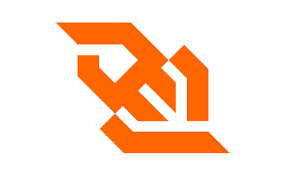
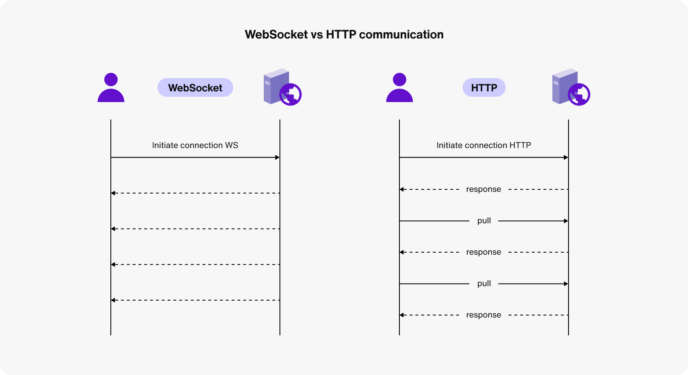

# 웹 소켓 (Web Socket)
<br>
이번에 개인 프로젝트에서 뉴스를 실시간으로 가지고 오기 위해서 웹 소켓을 사용하게 되었는데 웹소켓에 대해 자세하게 사용하고 싶어서 공부하게 되었다

## Web Socket
**Web Socket은 웹 앱과 서버간의 지속적인 연결을 제공 해주는 것**으로 이를 통해 서버와 클라이언트 간에 양방향 통신이 가능해집니다<br>
웹 소켓은 HTTP와 달리 한번 열린후 계속 연결이 유지 되므로 서버나 클라이언트에서는 언제든지 데이터를 보낼 수 있는 것이 특징이다

그렇기에 실시간으로 진행되는 통신에서 많이 사용된다

## 웹 소켓의 등장 배경
초기의 인터넷 환경에서는 HTTP 를 이용한 클라이언트(요청) - 서버(응답) 모델을 통해 진행되었습니다

즉 클라이언트에서 서버에게 요청을 보내고 서버가 이에 응답을 하는 통신 방식을 따릅니다

이 HTTP방식은 현재 가장 많이 쓰는 방식이지만 실시간으로 데이터를 주고 받는 데에는 한계점이 있다
요청과 응답이 있다는 것은 클라이언트가 서버에게 요청하지 않는 이상 서버는 클라이언트에게 먼저 데이터를 보낼 수 없게 되기 때문에 클라이언트는 항상 새로운 데이터가 있는지 확인을 하기 위해서는 서버에 지속적으로 요청을 보낼 수밖에 없습니다

그렇게 된다면 불필요한 트레픽이 많아져 서버의 비용이 증가되고 요청과 응답 사이에 지연 시간이 발생해 실시간 통신 효율성을 떨어뜨린다

이를 방지하고자 나온것이 바로 Web Socket이다

## 웹소켓(Web Socket)이란?

웹 소켓은 HTML5에 등장한 실시간 웹 애플리케이션을 위해 설계된 통신 프로토콜이며 TCP(Transmission Controller Protocol)를 기반으로 합니다.

HTTP와 다르게 클라이언트와 서버간에 최초로 연결이 이루어 지면 이 연결을 통해 양방향으로 통신을 지속적으로 할 수 있습니다<br>
즉 전화통화나 채팅기능 처럼 양쪽 모두 정보를 주고 받을 수 있습니다

이때 데이터는 패킷(packet) 형태로 전달되며, 전송은 연결 중단과 추가 HTTP 요청 없이 양방향으로 이루어집니다

이때 데이터는 패킷 형태로 전달되며 전송은 연결 중단과 추가 HTTP 요청 없이 양방향으로 이뤄집니다

## 웹소켓 연결 방법
웹소켓 연결 자체는 매우 간단하다 애초당 브라우저 자체에 웹 소켓 api를 지원하므로 new 웹소켓만 호출하여 사용하면 된다

**이때 `ws`라는 특수 프로토콜을 사용한다**<br>
```const socket = new WebSocket("wss://example/chat");```

소켓이 정상적으로 생성되면 아래 4개의 이벤트가 사용가능할 수 있게 된다
- Open - 연결이 성공적으로 되었을 때
- Message - 데이터를 수신하였을 때
- Error - 연결 상 에러가 발생했을 떄
- Close - 연결이 종류 되었을 때
```
let socket = new WebSocket("wss://example/chat");

socket.onopen = function(e) {
  alert("[open] 커넥션이 만들어졌습니다.");
  socket.send("안녕!");
};

socket.onmessage = function(event) {
  alert(`[message] 서버로부터 전송받은 데이터: ${event.data}`);
};

socket.onclose = function(event) {
  if (event.wasClean) {
    alert(`[close] 커넥션이 정상적으로 종료되었습니다(code=${event.code} reason=${event.reason})`);
  } else {
    // 예시: 프로세스가 죽거나 네트워크에 장애가 있는 경우
    // event.code가 1006이 됩니다.
    alert('[close] 커넥션이 죽었습니다.');
  }
};

socket.onerror = function(error) {
  alert(`[error]`);
};
```

## 웹 소켓(Web Socket) handshake
위에서 본것 처럼 WebSocket(url)을 호출해 소켓을 생성하면 즉시 연결이 된다

`new WebSocket('wss://example/chat')` 을 호출해 최초 요청을 전송했다고 가정하고 이때의 요청 헤더를 살펴보겠다
```
GET /chat
Host: example
Origin: https://example
Connection: Upgrade
Upgrade: websocket
Sec-WebSocket-Key: Iv8io/9s+lYFgZWcXczP8Q==
Sec-WebSocket-Version: 13
```

- `Origin`: 클라이언트 Origin을 나타냅니다
- `Connection`: 클라이언트 측에서 프로토콜을 바꾸고 싶다는 신호를 보냈다는 것을 나타냅니다
- `Upgrade`: 클라이언트 측에서 요청한 프로토콜은 'websocket’이라는 것을 의미합니다
- `Sec-WebSocket-Key`: 보안을 위해 브라우저에서 생성한 키로, 서버가 웹소켓 프로토콜을 지원하는지를 확인하는 데 사용됩니다
- `Sec-WebSocket-Version`: 웹소켓 프로토콜 버전을 나타냅니다

다음으로 서버가 해당 요청을 받으면 웹 소켓 연결을 수락하는 응답을 보냅니다

해당 응답에는 '101 Switching Protocols' 상태 코드와 함께 응답합니다
```
101 Switching Protocols
Upgrade: websocket
Connection: Upgrade
Sec-WebSocket-Accept: hsBYongNyong24s99EO10UlZ22C2g=
```
이 과정을 통해 실시간으로 통신이 가능한 통로가 열리게 됩니다

이렇게 웹 소켓 연결이 성립되면 클라이언트와 서버 간의 실시간 양방향 통신이 가능해집니다

## 웹 소켓의(Web Socket)의 한계점
양방향 통신이라는 아주 큰 장접을 가진 웹소켓은 어떤 한계점을 가지고 있냐면
- **브라우저 지원**: 웹 소켓은 HTML5 사양의 일부여서 HTML5을 지원하지 않는 브라우저에서 사용할 수 없음
- **서버비용**: 웹소켓은 한번 연결하면 연결을 해제하라는 명령이 없다면 계속 연결을 해 놓기 때문에 서버에 부화가 와 서버 비용이 증가할 수 있다
- **상세한 오류 처리**: 만약 웹소켓이 끊어지게 된다면 끊어진 이유에 대해서 알 수 없습니다 따라서 그에 따른 오류 처리 방법이 어려울 수 있습니다
