# OAuth 2.0
OAuth는 인터넷 사용자들이 비밀번호를 제공하지 않고 다른 웹사이트 상에 자신들의 정보를 제공할 때 웹 사이트나 애플리케이션등에 접근 권한을 제공 하는 것을 말한다

OAuth의 구성요소는 아래와 같다
- <span style="color: skyblue;">**Resource Owner** </span>: 웹 서비스를 사용하려는 사용자, 정보를 가지고 있는 자
- <span style="color: skyblue;">**Client**</span> : 자사 또는 개인이 만든 애플리케이션 서버
- <span style="color: skyblue;">**Authorization Server**</span> : 권한 부여를 해주는 서버이다
- <span style="color: skyblue;">**Resource Server**</span> : 사용자의 개인정보를 가지고있는 애플리케이션 (Google, Facebook, Kakao 등) 회사 서버
- <span style="color: skyblue;">**Access Token**</span> : 자원에 대한 접근 권한을 Resource Owner가 인가하였음을 나타내는 자격증명
- <span style="color: skyblue;">**Refresh Token**</span> : 비교적 기한이 짧은 access token이 만료 되어도 refresh token으로 access token을 재발급 해주어 다시 로그인 해줄 필요 없게 만드는 토큰


직접 사용자가 로그인이 하는 것이 아닌 google이나 instargram등으로 로그인 할때 

client는 Resource Owener를 대신해 로그인 하게 되는데 이때 필요한 정보를 가지고 있는 Resource Server 에서 정보를 받아 서로 비교해 유효성을 판단한다

간단히 말하자면 client가 유저의 정보/자원을 받아 Resource Server에 요청해 대신 로그인 하는 방식이다

위의 방식을 위해 client는 다음과 같은 단계를 가진다

1. <span style="color: skyblue;">**Resource Owner**</span>로 부터 동의(허용)
2. <span style="color: skyblue;">**Resource Server**</span>로 부터 client 신원확인

왜 저런 단계를 거처야 하냐면 

## 유저의 입장
**유저의 입장** 에서는 자신의 정보를 대신 사용하는 것이기 때문에 나쁜 마음을 먹고 개인정보를 마구잡이로 악용할 수 있기 때문이다

## 서버의 입장
 **서버의 입장**에서는 자신이 대신 일을 해주는 사람이 진짜 자신에게 요청을 해 대신 해달라 해준 사람이 맞는지 궁금해 할 수 있기 때문이다

 이런 의미에서 **Resource Server**는 **Resource Owner**의 브라우저에서 <span style ="color : skyblue;">**client**를 구별하는 코드</span>를 전달 해준다

 ## Resource Owner 승인과정
 > ### <center>참고</center>
 > **내가 참고한 강의에선 Resource Serveer와 Authorization Server를 합쳐서 설명 해주었기 때문에 참고해라**

 1. 사용자(Resource Owner)는 서비스(Client)를 이용하기 위해 로그인 페이지로 접근한다
 2. 그럼 서비스(Client)는 사용자(Resource Owner)에게 로그인 페이지를 제공하게 된다
 3. 로그인 페이지에서는 사용자는 <span style="color : #DB4455;">**구글로 로그인/페이스북으로 로그인/카카오톡으로 로그인/네이버로 로그인**</span>중 자신이 로그인 할 소셜 로그인 버튼을 클릭한다
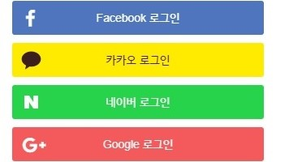

4. 만일 사용자가 <span style="color : #DB4455;">**Feacebook 로그인 버튼**</span>을 클릭하게 된다면 특정한 url이 페이스북 서버쪽으로 보내지게 된다
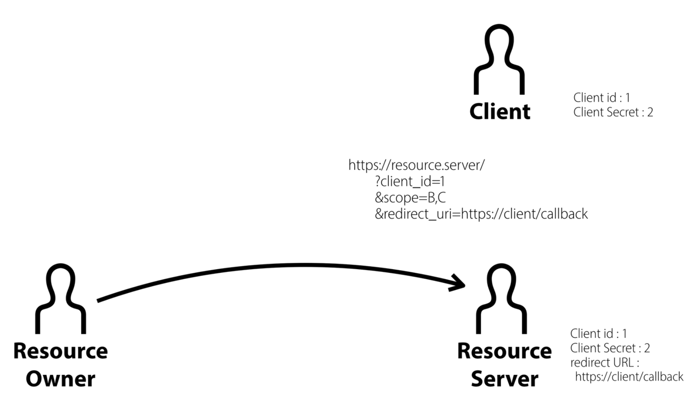
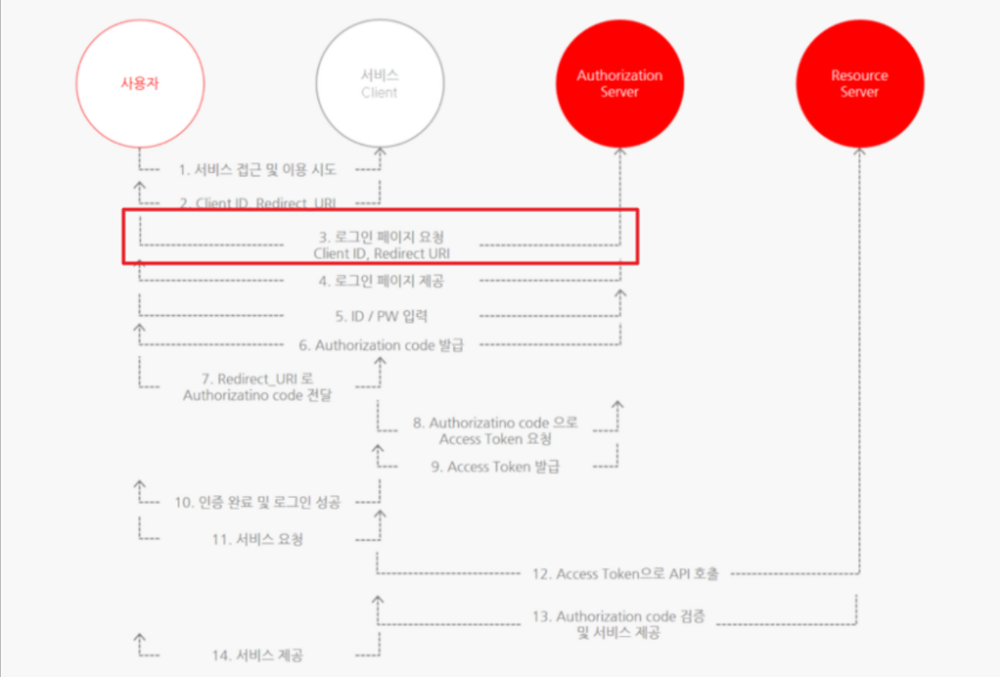

위의 과정을 지나게 되면 브라우저 응답(Response) 헤더를 확인하게 되면 다음과 같은 url을 확인 할 수 있다
```
https://resource.server/?client_id=1&scope=B,C&redirect_uri=https://client/callback
```
위의 url은 사용자가 직접 페이스북으로 이동해 로그인 하는 것이 아닌 저 링크가 대신해 로그인 해주는 것을 의미한다

구체적으로 저 코드가 어떻게 구성되어 있는지 알아 보기 위해 코드를 아래와 같이 분리 해 보았다
```
https://resource.server/? # 리소스 서버(네이버, 카카오 사이트 url)
client_id=1 # 어떤 client인지를 id를 통해 Resouce Owner에게 알려주는 부분
&scope=B,C # Resource Owner가 사용하려는 기능, 달리 말해 client가 자신 서비스에서 사용하려는 Resource Server 기능을 표현한 부분
&redirect_uri=https://client/callback # 개발자 홈페이지에 서비스 개발자가 입력한 응답 콜백
```
향후 <span style="color : red;">redirect_uri 경로를 통해서 Resource Server는 client에게 임시비밀번호인 Authorization code를 제공</span>한다

5. 클라이언트로부터 보낸 서비스 정보와, 리소스 로그인 서버에 등록된 서비스 정보를 비교한다
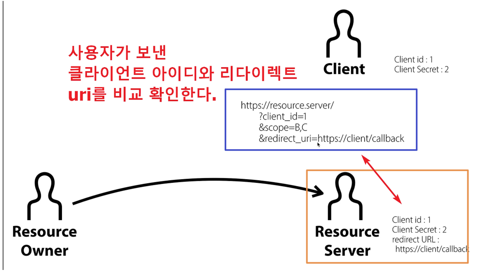
5.1 확인이 완료되면, Resource Server로 부터 전용 로그인 페이지로 이동하여 사용자에게 보여준다
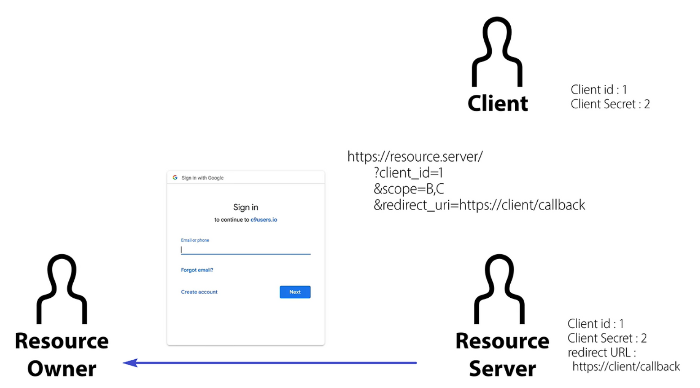
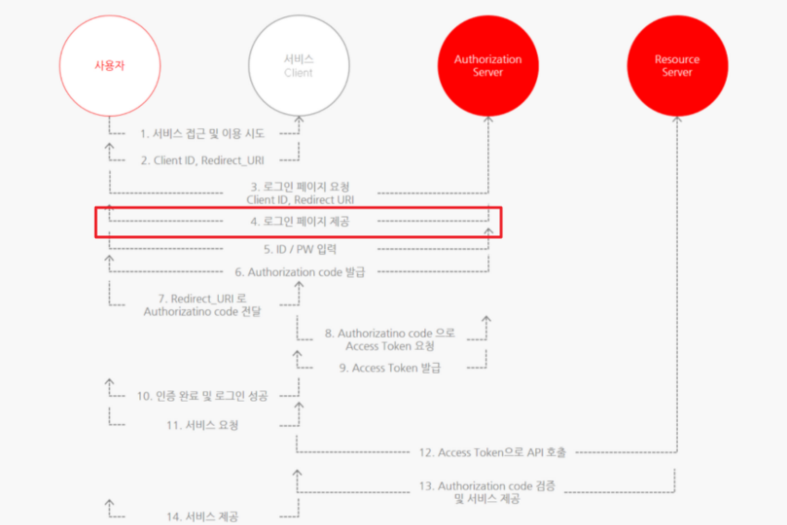

6. ID/PW를 적어서 로그인을 하게되면, client가 사용하려는 기능(scope)에 대해 Resource Owner의 동의(승인)을 요청한다
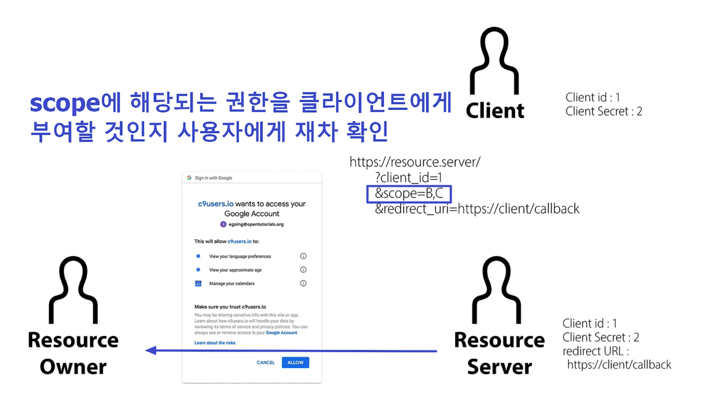
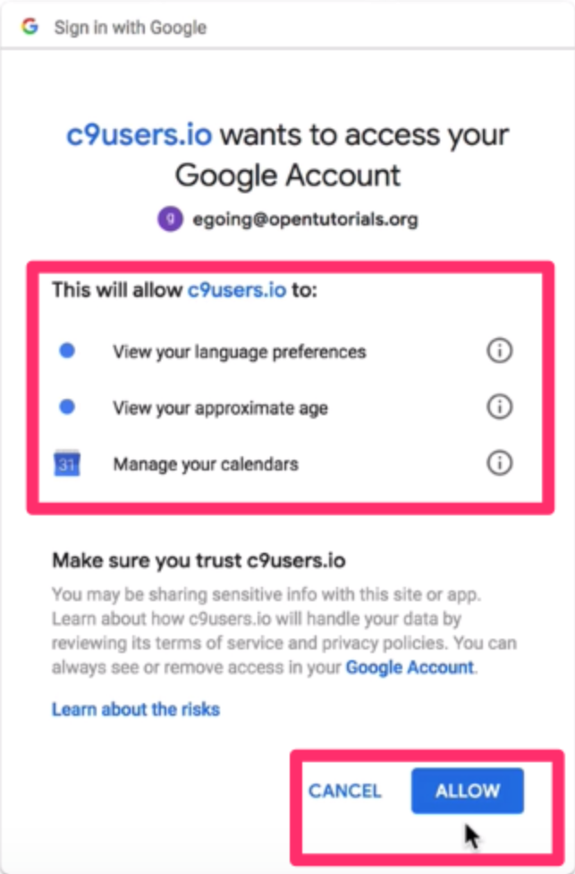

> ## <center>info</center>
> 
> 위 이미지의 의미는 다음과 같다
>
><span style="color : skyblue"> "c9users.io라는 client(서비스,application)는 Resoure Owner를 대신해 해당 기능(scope)를 사용하려고 합니다. 동의하시겠습니까?"</span>
>
> 동의(Allow)를 누르는 것은 Resoure Owner는 Client가 해당 기능 사용에 위임(delegation)했다를 의미한다

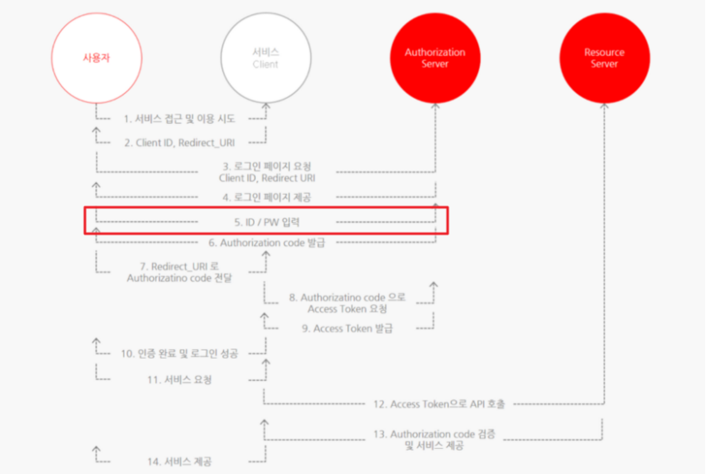

6.1 Resource Owner가 Allow 버튼을 누르면 Resource Owner가 권한을 위임 했다는 승인이 Resource Server에 전달한다.

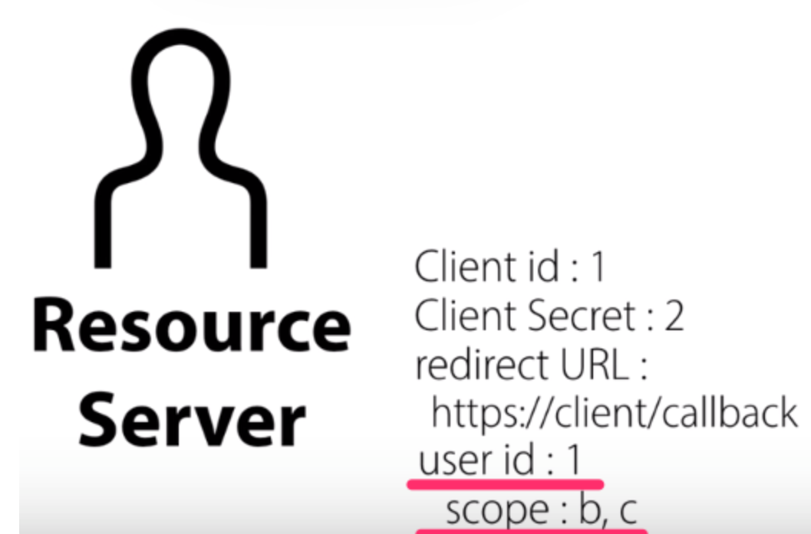
이로써 Resource Server가 가지는 정보는 다음과 같다
   1. Client Id : Resource Owner와 연결된 client가 누구인지
   2. Client Secret : Resource Owner와 연결된 client의 비밀번호
   3. Redirect URL : (진짜)Client와 연결할 통로
   4. user id : client와 연결된 Resource Owner의 id
   5. scope : client가 Resource Owner 대신에 사용할 기능들


7. 아무리 **Owner**가 **Client**에게 권한을 승인 했더라도 **Server가 허락하지 않았기 때문에** Resource Server도 Client에게 권한을 승인 하기위해** <span style = "color : red;">Authorization code</span>를 <span style = "color: blue;">Redirect URL</span>을 통해 사용자에게 응답을 보내고

8. 다시 사용자는 그대로 Client에게 다시 보낸다.
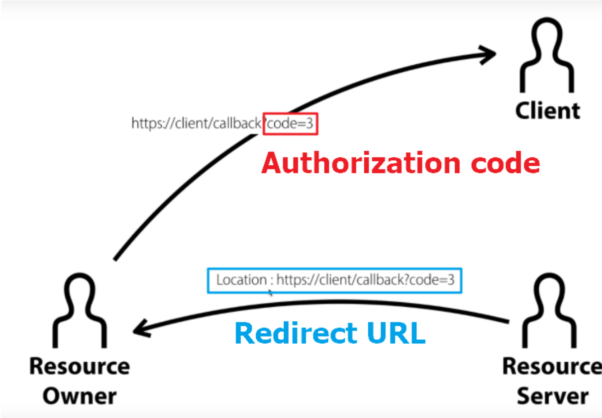
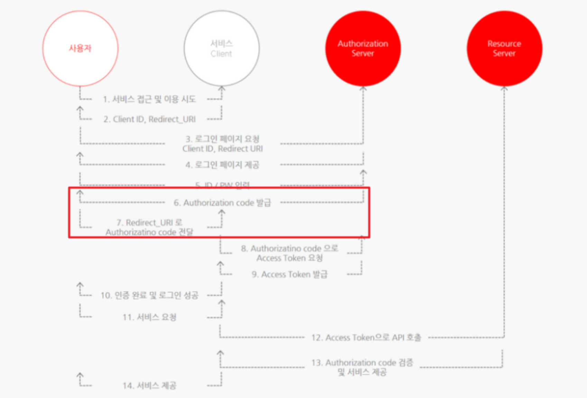<br>
이를 통해 client는 Resource Server가 보낸 Authorization code, "code = 3"를 Resource Owner통해 받는다
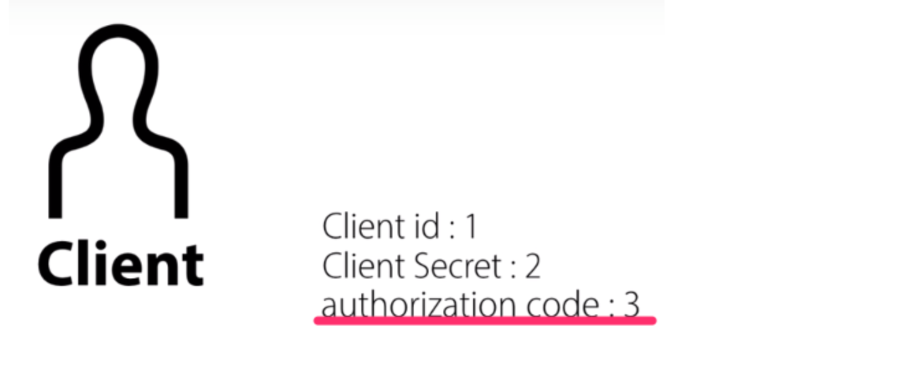

9. 이제 client가 Resource Server에게 직접 url을(클라이언트 아이디, 비밀번호, 인증코드 등등)보낸다
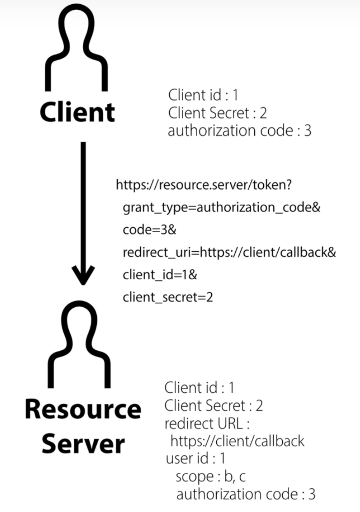
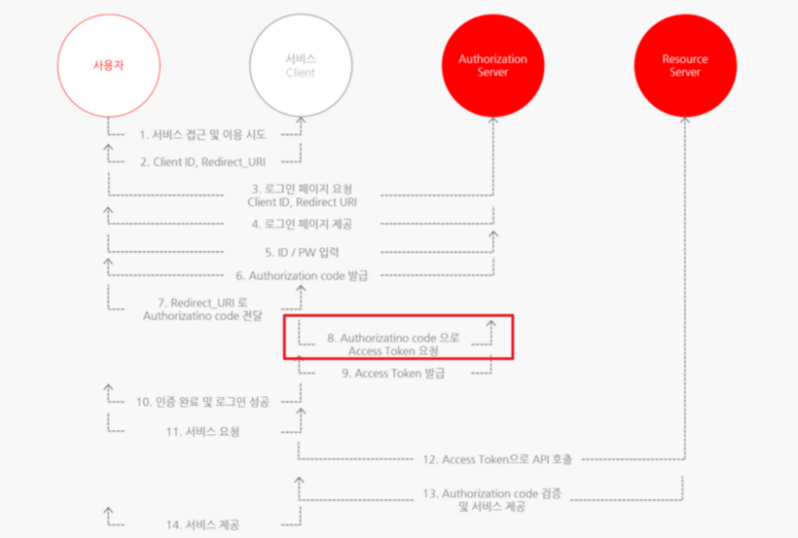
10. 그럼 Resource Server는 Client가 전달한 정보들을 비교해서 일치한다면 Access Token을 발급한다 그리고 이제 필요 없어진 Authorization code는 지운다
11. 그렇게 토큰을 받은 Client는 사용자에게 최종적으로 로그인이 완료되었다고 응답한다
> **<center> Tip </center>**
> OAuth의 목적은 최종적으로 Access Token을 발급하는 것이다

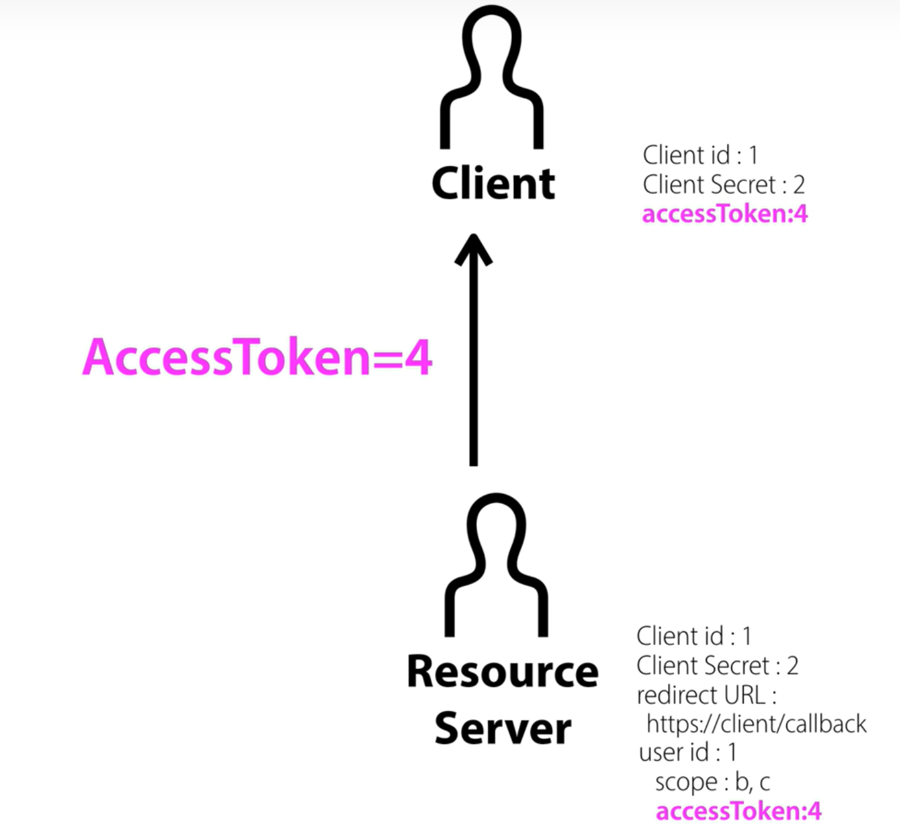
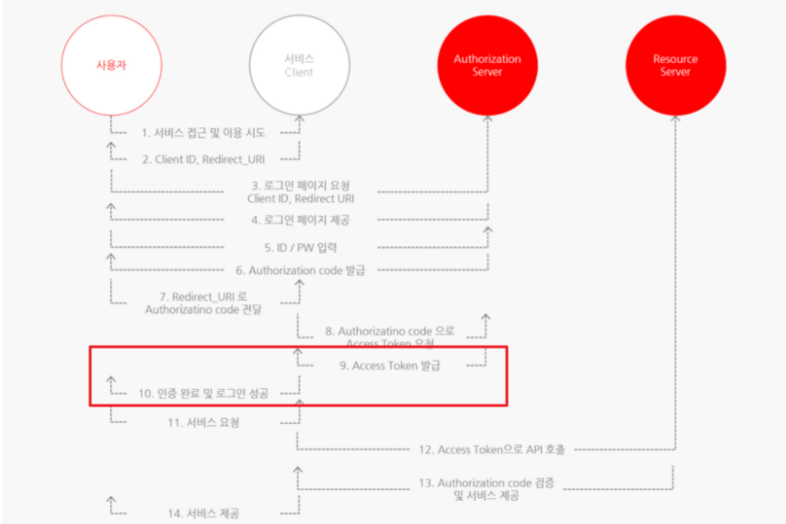

이제 client는 Resource server의 api를 요청해 Resource Owner의 ID 혹은 프로필 정보를 사용할 수 있다

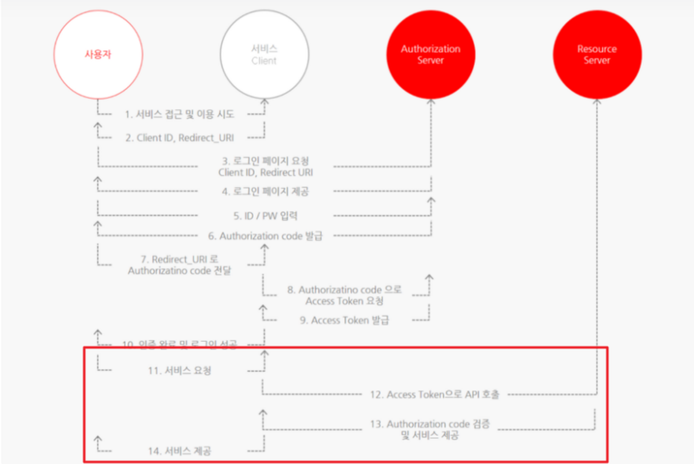
만약 Access Token이 만료되면 401에러가 나게 되는데 Refresh Token을 통해 Access Token을 재 발급 해주면 된다
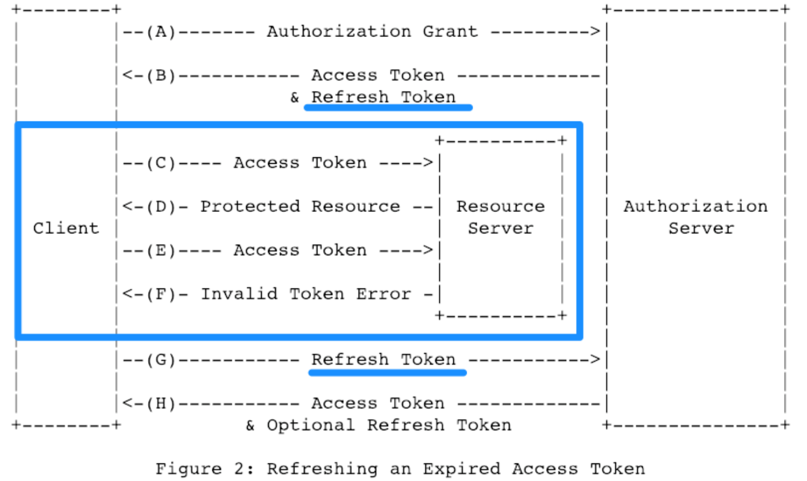