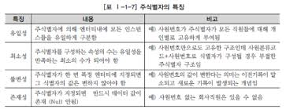
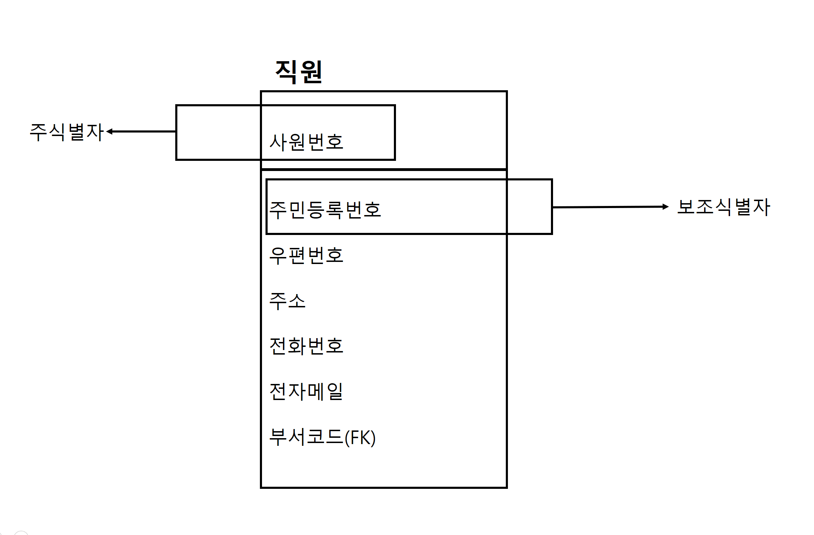
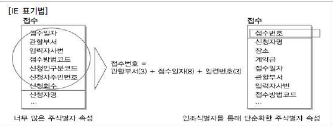

# 05. 식별자
### 3. 식별자 특징

## 2️⃣주식별자 도출 기준
1. **업무 활용도가 높은 속성 선택** 
엔티티 내 유일성을 갖춘 속석 중에서 해당 업무에서 빈번히 조회되고 활용되는 속성을 주식별자로 설정하는 것이 바람직 하다.

2. **명칭 기반 속성 지양**
명칭이나 내역 등 문자 정보로 표현되는 속성은 업무 관점에서 자주 변경되거나 중복될 가능성이 높으므로 일반적으로 주식별자로 지정하지 않는 것이 바람직 하다

3. **복합식별자 구성 시 과도한 속성 포함 방지**
여러 속성을 결합하여 복합식별자를 구성 할 경우 너무 많은 속성을 포함하지 않도록하는 것이 바람직 하다

> ### `확인 문제`
> **주식별자로 가장 적합한 것은?**
> 1. 상품명
> 2. 상품코드
> 3. 상품 설명
> 4. 생상일자와 가격을 결합한 속성
> `| 정답 |` 2 
> `| 해설 |` 상품코드는 엔티티 내에서 유일성을 가지며 업무에서 자주 활용되는 속성이므로 주식별자로 적절하다