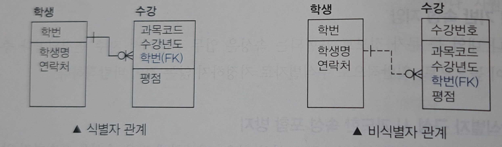
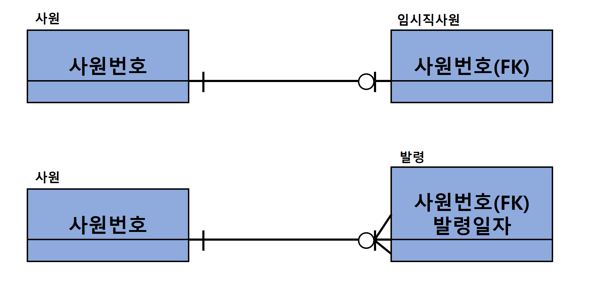
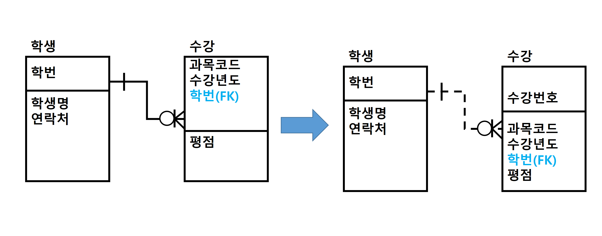
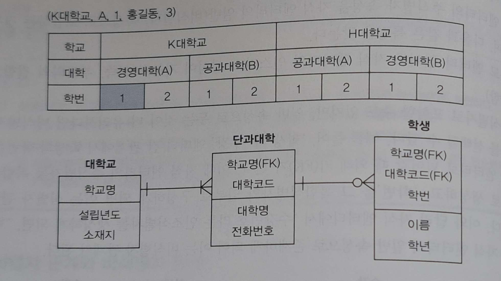
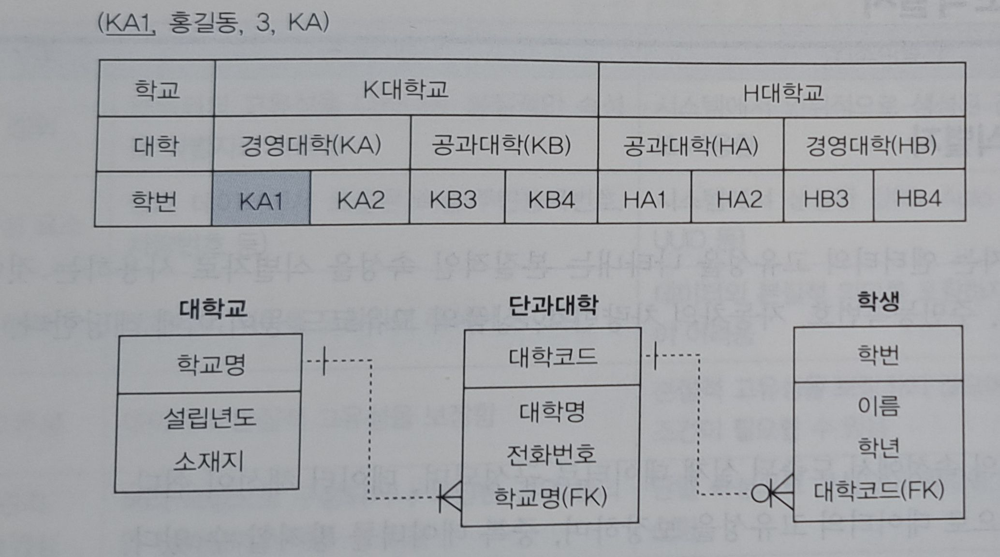
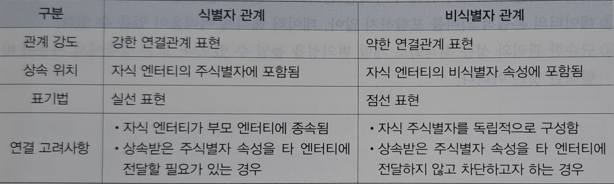
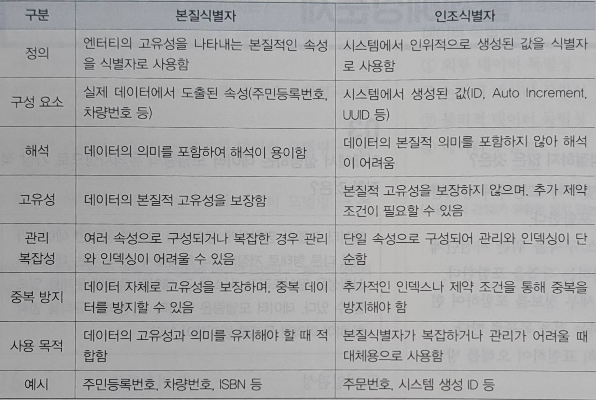

# 05 식별자
## 3️⃣ 식별자 관계와 비식별자 관계
엔티티 간 관계를 정의할 때 부모 엔티티의 주식별자를 엔티티에 어떻게 상속시키느냐에 따라서 식별자 관계와 비식별자 관계로 나뉜다
> 부모 엔티티의 식별자 A를 자식 엔티티의 외부식별자 A(FK)로 포함할 때
> - A(FK)가 주식별자에 포함된 경우 -> 식별자 관계
> A(FK)가 일반 속성으로 포함된 경우 -> 비식별자 관계

**1. 식별자 관계(Identifying Relationship)** 
부모 엔티티의 주식별자 속성을 자식 엔티티가 주식별자로 상속받는 경우를 말하며 다음과 같은 특징을 가진다
1. **부모 엔티티가 생성되지 않으면 자식 엔티티 또한 존재할 수 없다**
2. **자식 엔티티는 주식별자에 부모 엔티티의 식별자(FK)가 반드시 포함**되며, 이 속성은 **NULL**을 허용하지 않는다
3. 관계 차수에 따른 분류
   - **자식 엔티티**의 주식별자가 **부모 식별자**만으로 구성되면 **1:1** 관계
   - **자식 엔티티**의 주식별자가 **부모 식별자** + **추가 속성**으로 구성되면 **1:N** 관계

**2. 비식별자 관계(Non-Identifying Relationship)** 
부모 엔티티의 주식별자 속성을 자식 엔티티의 일반(비식별자) 속성으로 포함하는 경우를 말하며 다음과 같은 특징을 가진다 
1. 부모 엔티티 없이도 자식 엔티티의 인스턴스 생성이 가능하다
2. 주식별자로 포함할 수도 있지만 일반 속성으로 두는 것이 더 유리하다면 비식별자 관계를 선택할 수 있다

> ## 확인문제
> **부모 엔티티의 주식별자가 자식 엔티티에서 외부식별자이면서 동시에 주식별자로 사용되는 관계는?**
> 1. 식별자 관계
> 2. 비식별자 관계
> 3. 필수 관계
> 4. 선택 관계 
> 
> `| 정답 |` 1 
> `| 해설 |` 식별자 관계는 부모 엔티티의 주식별자를 자식 엔티티로  전달하며 이 주식별자가 자식 엔티티의 주식별자이자 외부식별자 역활을 한다

## 4️⃣ 식별자/비식별자 관계 남용 시 문제
**1. 식별자 관계 남용시 문제** 
식별자 관계를 과도하게 사용하면 주식별자 속성이 점점 늘어나는 문제가 발생한다

**2. 비식별자 관계 남용 시 문제** 
비식별자 관계를 과도하게 사용하면 데이터 조회시 조인(JOIN) 횟수 증가라는 문제가 발생 할 수 있다

**3. 비식별자 관계를 고려해야 하는 경우** 
**(1) 부모-자식 관계 강도가 약할 때** 
부모 엔티티가 존재하지 않아도 자식 엔티티가 독립적으로 생성되고 운영될 수 있는 경우, 비식별자 관계를 적용함으로써 부모 엔티티와의 약한 종속성을 표현할 수 있다

**(2) 자식 엔티티가 독립적인 주식별자를 갖는 경우** 
자식 엔티티가 독자적인 주식별자를 가지고 있는 경우라면 비식별자 관계를 통해 모델을 단순화 하고 유연성을 확보할 수 있다

**(3) PK 속성의 단순화 필요성**
식별자 관계를 남용하면 PK에 속성이 많이 쌓여 복잡해질 수 있다 반면 비식별자 관계를 활용하면 복합식별자의 복잡성을 줄이고 PK구성을 단순화 시킬 수 있다

**4. 식별자 관계와 비식별자 관계 비교**

# 06 본질식별자 VS 인조식별자
## 1️⃣ 본질식별자
**1. 개념** 
본질식별자는 엔티티의 고유성을 나타내는 본질적인 속성을 식별자로 사용하는 것이다

**2. 특징**
1. 엔티티의 속성에서 도출된 실제 데이터로 구성되며, 데이터 해석이 쉽다.
2. 본질적으로 데이터의 고유성을 보장하며, 중복 데이터를 방지할 수 있다
3. 본질식별자가 여러 속성으로 구성되거나 데이터 구조가 복잡할 경우 관리와 인덱싱이 어려울 수 있다

## 2️⃣ 인조식별자
**1. 개념** 
인조식별자는 시스템에서 고유성을 보장하기 위해 인위적으로 생성된 값을 식별자로 사용하는 것이다

**2. 특징** 
1. 단일 속성으로 구성되며 본질식별자보다 관리가 단순하다 본질식별자가 복잡할 경우 대체해서 사용하기도 한다
2. 인조식별자는 본질적인 교유성을 나타내지 않으므로 중복데이터를 방지하거나 데이터의 의미를 유지하기 위해 사용한다
3. 데이터의 본질적 의미를 포함하지 않아 데이터 해석에 어려울 수 있다
4. 단순한 관리와 성능 최적화로 개발 편의성을 높일 수 있으나 모든 상황에서 바람직한것은 아니다

## 3️⃣본질식별자와 인조식별자 비교
