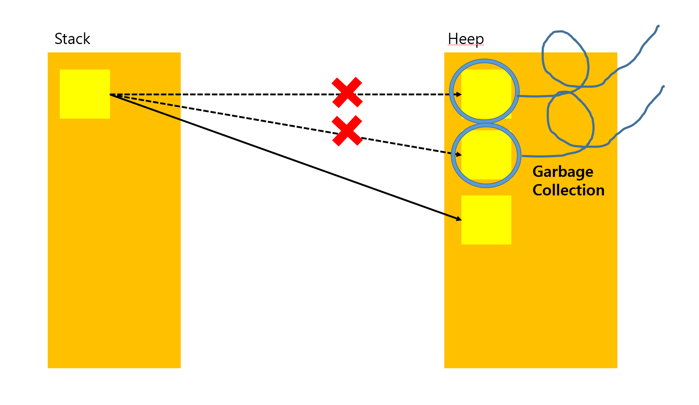
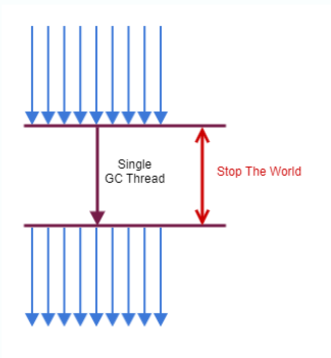
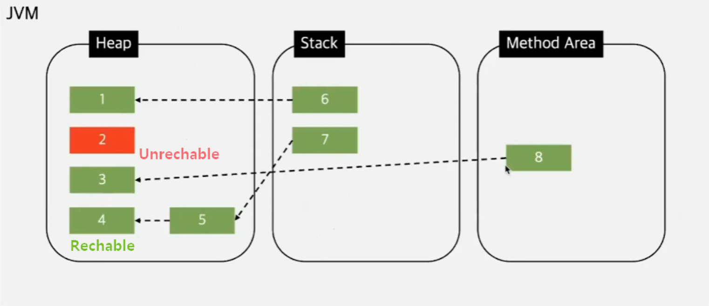
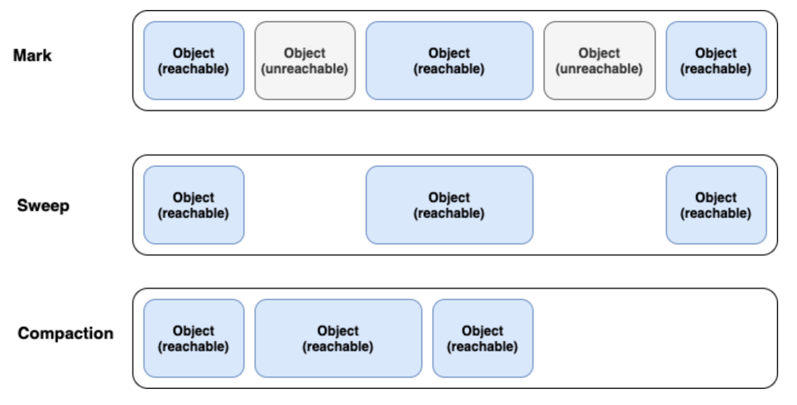
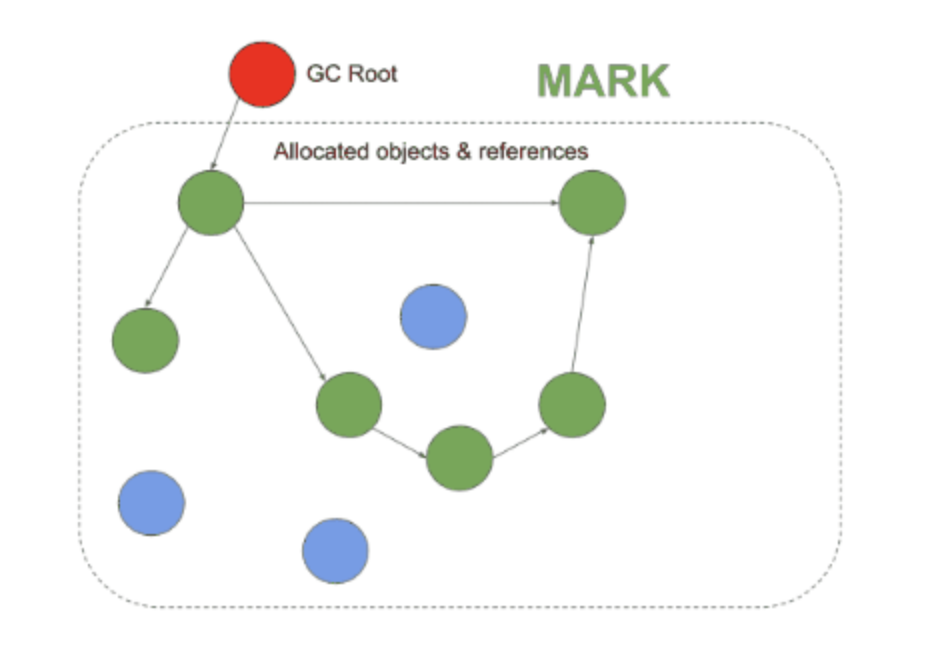
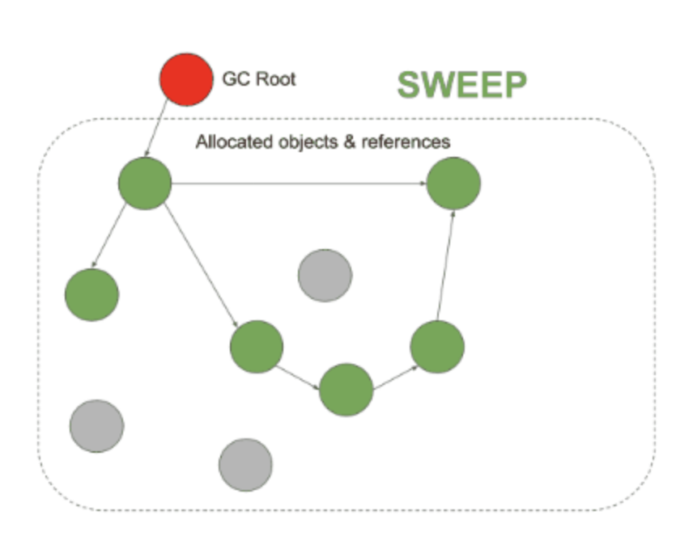
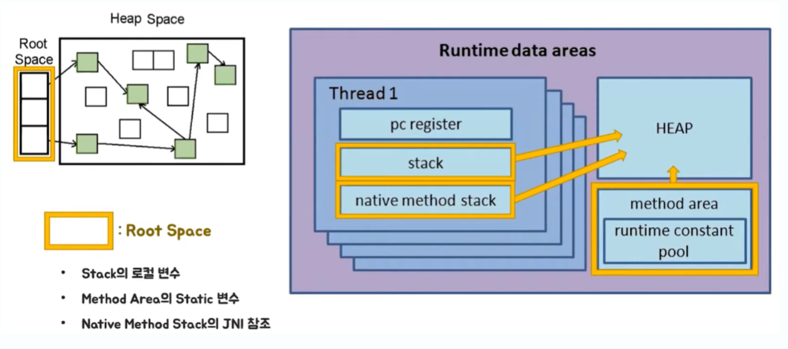

# Garbage Collection(GC)란?
Garbage Collection이란 자바 메모리 관리 방법 중 하나로 JVM(Java Virtual Machine) 의 Heep 영역에서 동적으로 할당 되었던 메모리 중 필요 없어진 Garbage를 주기적으로 제거하는 프로세스를 말한다

C / C++ 언어에서는 이런 **가비지 컬렉션**이 없어 사용자 스스로 메모리 할당과 헤제를 했어야 했는데 Java는 **가비지 컬렉터가 메모리를 관리 해주기 때문**에 개발자 입장에선 메모리 관리 메모리 누수 관련 문제에 대해 관리를 하지 않아도 되어 오롯이 개발에만 집중이 가능하다.

또한 가비지 컬렉션(GC)는 꼭 자바에만 있는 개념이 아니다 파이썬, 자바스크립트, Go언어등 다양한 프로그래밍 언어에서 GC가 기본으로 내장 되어 있다

그러나 GC또한 단점이 없는건 아니다 GC의 작동은 사용자가 컨트롤 할 수 없기 때문에 제어하기 힘드며 GC가 동작하는 과정에선 다른 동작이 멈추기 때문에 오버헤드가 발생하기도 한다

이를 STW(Stop - The _ World)라고 한다
> ## STW 
> GC를 수행하기 위해 JVM이 프로그램을 멈추는 현상을 의미한다.
>
> GC가 작동하는 과정에서 GC의 Thread를 제외한 나머지 Thread는 멈추게 된다 때문에 서비스 이용에 차질이 생긴다 따라서 STW를 최소화 시키는 것이 쟁점이다
> 

## 가비지 컬렉션 대상
가비지 컬렉션은 특정 객체가 garbage인지 아닌지 판단하기 위해서 도달성, 도달능력(Reachability) 이라는 개념을 적용한다

객체에 레퍼런스가 있다면 Reachable로 구분되고, 객체에 유효한 레퍼런스가 없다면 Unreachable로 구분해버리고 수거해버린다

Reachable : 객체가 참조되고 있는 상태
Unreachable : 객체가 참조되고 있지 않은 상태

예를들어 JVM 메모리에선 실질적으로 Heap영역에서 생성되고 Method Area이나 Stack Area 에서는 Heap Area에 생성된 객체의 주소만 참조하는 형식으로 구성된다

하지만 이렇게 생성된 Heap Area의 객체들이 메서드가 끝나고 특정 이벤트들로 인하여 Heap Area 객체의 메모리 주소를 가지고 있는 참조 변수가 삭제되는 현상이 발견되면 Heap영역에서 참조하지 않은 객체(Unreachable)들이 발생한다
 이러한 객체들을 주기적으로 가비지 컬렉터가 제거해주는 것이다.

## 가비지 컬렉터 청소 방식
GC가 Unreachable한 객체가 어떤 방식으로 청소하는지 알아보자

### Mark And Sweep
Mark-Sweep 이란 다양한 GC에서 사용되는 객체를 솎아내는 내부 알고리즘이다.

가비지 컬렉션이 동작하는 아주 **기초적인 과정**이라 생각하면 된다

원리는 간단하다 
가비지 컬렉션이 될 대상 객체를 식별하고(Mark)하고 제거(Sweep) 하며 객체가 제거되어  파편화된 메모리 영역을 앞에서부터 채워나가는 작업(Compaction)을 수행하게 된다

- **Mark 과정** : 먼저 Root Space로 부터 그래프 순회를 통해 연결된 객체들을 찾아내어 각각 어떤 객체를 참조하고 있는지 찾아서 마킹한다
- **Sweep 과정** : 참조하고 있지 않은 객체 즉 Unreachable 객체들을 Heap에서 제거한다
- **Compact 과정** : Sweep 후에 분산된 객체들을 Heap의 시작 주소로 모아 메모리가 할당된 부분과 그렇지 않은 부분으로 압축한다. (가비지 컬렉터 종류에 따라 하지 않는 경우도 있음)

#### Mark

#### Sweep

이렇게 Mark And Sweep 방식을 사용하면 루트로부터 연결이 끊긴 순환 참조되는 객체들을 모두 지울수 있다.

> ### Info
> **[GC의 Root Space]** 
> Mark And Sweep 방식은 루트로 부터 해당 객체에 접근이 가능한지가 해제의 기준이 된다 
> JVM GC에서의 Root Space는 Heap 메모리 영역을 참조하는 method area, static 변수, stack, native method stack이 되게 된다
> 