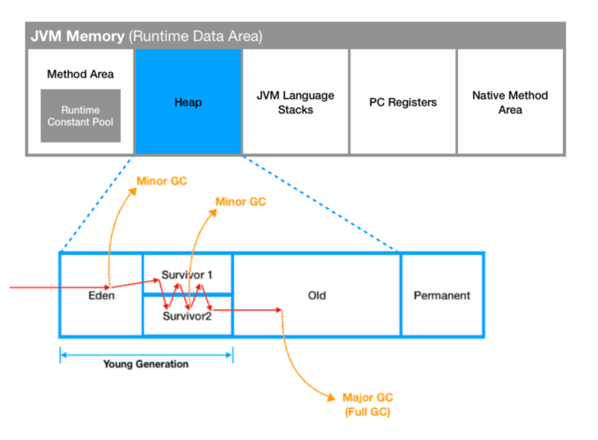
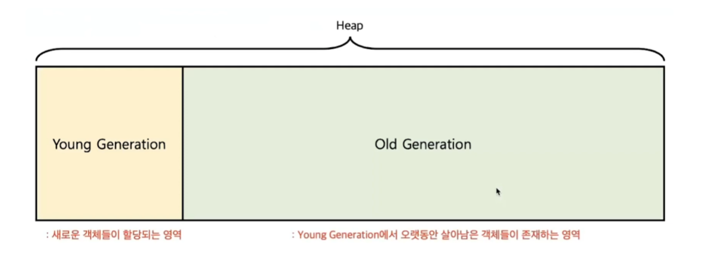
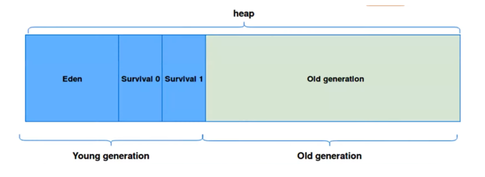
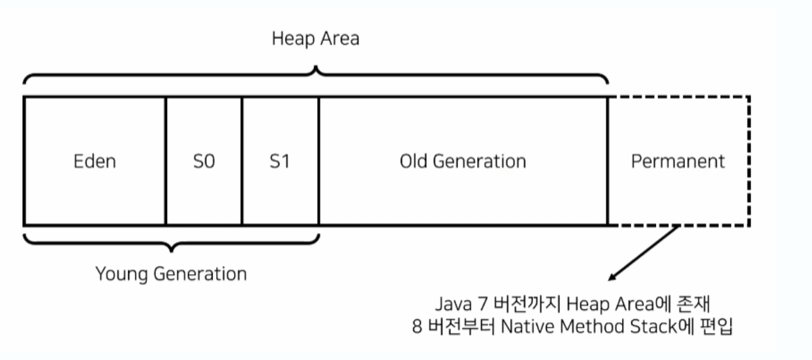

# Garbage Collection(GC)
## 가비지 컬렉션 동작 과정

---------------
## Heap 메모리의 구조
JVM의 Heap 영역은 동적으로 레퍼런스 데이터가 저장되는 공간으로 가비지 컬렉션의 대상이 되는 공간이다 

**Heap**영역은 처음 설계될 때 2가지를 전제(Weak Generational Hypothesis)로 셀계되었다

- ⓘ 대부분의 객체는 금방 접근 불가 상태(Unreachable)가 된다
- ⓘ 오래된 객체에서 최근 객체로의 참조는 아주 적게 존제한다

즉, **객체는 대부분 일회성이며, 메모리에 오래남아 있는 경우는 매우 드믈다**는 것이다

이러한 특성을 이용하여 JVM 개발자들은 Heap 영역을 Old 영역과 Young 영역으로 물리적 Heap 영역을 나누었다

### Young 영역
- 새롭게 생성된 객체가 할당(Allocation)되는 영역
- 대부분의 객체가 금방 Unreachable상태가 되기 때문에 많은 객체가 Young 영역에서 생성 됬다가 사라진다
- Young 영역에 대한 가비지 컬렉션을 Minor GC라고 부른다

### Old 영역
- Young 영역에서 Unreachable상태를 유지하여 살아남은 객체가 복사되는 영역
- Young 영역보단 크게 할당되며 크기가 큰 만큼 가비지는 적게 발생한다
- Old 영역에서의 가비지 컬렉션을 Major GC 또는 Full GC라고 부른다

위 그림에서, Old 영역이 Young 영역보다 크게 할당되는 이유는 Young 영역의 수명이 짧은 객체들은 큰 공간을 필요로 하지 않으며 큰 객체들은 Young 영역이 아니라 바로 Old 영역에 할당되기 때문이다

또 다시 힙 영역을 더욱 효율적인 GC 위해서 Young 영역을 3가지(Eden, survivor 1, survivor 0)으로 나눈다

### Eden
- new를 통해 새로 생성된 객체가 위치한다
- 정기적인 쓰레기 수집 후 살아남은 객체를 survivor 영역으로 보낸다
  
### survivor 0 / survivor 1
- 최소 한번 이상 GC에서 살아남은 객체가 존재하는 영역
- survivor 영역에선 특별한 규칙이 있는데 survivor 0, survivor 1 둘 중 하나에는 꼭 비어 있어야 하는 것이다

이렇게 하나의 힙 영역을 세부적으로 쪼갬으로서 객체의 생존 기간을 면밀하게 제어하여 가비지 컬렉터(GC)를 보다 정확하게 불필요한 객체를 제거하는 프로세스를 실행하도록 한다

힙 영역 내부 구조에 대해 자세히 알아봤으니, 실제로 객체가 가비지 컬렉터로 제거되는 과정을 그림으로 학습해보자

> ### Info
> **[ Java 8 에서의 Permanent]** 
> Permanent는 직역하면 영구적인 세대의 의미로서 생성된 객체들의 정보가 저장되어 있는 영역이다. 
> 클래스 로더에 의해 load되며 Class, Method 등에 대한 Meta 정보가 저장되는 영역이고 JVM에 의해 사용된다. 
> Java 7 까지는 힙 영역에 존재했지만 Java 8 버전 이후에는 Native Method Stack에 편입되게 된다
> 