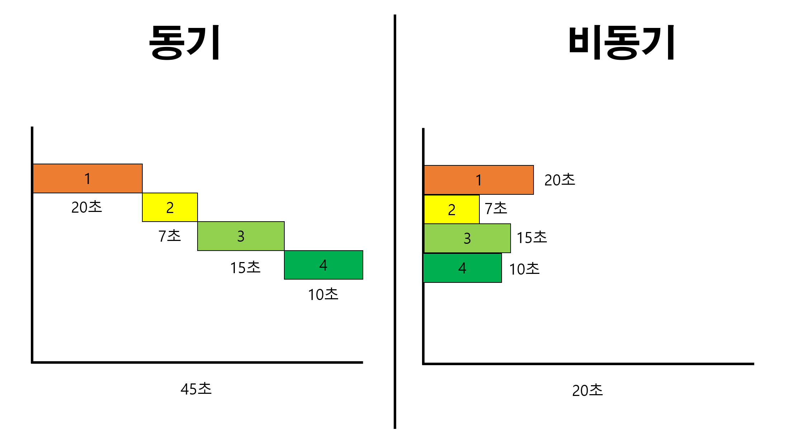

# @Async에 대해 알아보자
먼저 @Async에 대해 알아보기 전에 비동기가 무엇인지 부터 알아보자

## 비동기(Asynchronous)
요청과 결과가 동시에 일어나지 않는다는 뜻으로 작업을 요청하고 결과가 발생 할 때 까지 기다리지 않아도 된다는 내용입니다


## @Async
Spring에서는 `@Async` 어노테이션을 제공하여 로직의 비동기 처리를 지원합니다

## 간단하게 사용하기
SpringBootApplication에서 `@EnableAsync` 어노테이션을 적용하여 사용
```
@EnableAsync
@SpringBootApplication
public class MySpringApplication {
	...
}
```

후에 메소드에 `@Async` 어노테이션을 명시하면 태스크 처리 비동기 방식으로 할 수 있습니다
```
public class AsyncService {
	@Async
    public void asyncMethod(){
    	...
    }
}
```
이렇게 간단하게 설정한다면 Thread Executor로 `SimpleAsyncTaskExecutor` 를 사용합니다

## 유의사항
@Async를 사용하려면 다음 내용을 지켜서 사용해야 합니다
1. method 접근 지정자가 private면 사용 불가
2. self-invocation(자가호출) 즉 inner-method는 사용 불가

위와 같은 두가지 유의사항을 지켜야 합니다