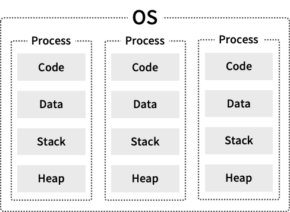
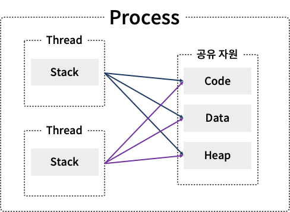

# 스레드란?
스레드와 멀티스레드에 대해 알아보고 코드까지 작성해보도록 하자

## 프로세스
스레드를 알려면 먼저 프로세스의 개념부터 알아야한다 프로세스는 현재 실행되고 있는 프로그램을 의미한다
 더 붙여 설명하면 메모리에 올라가서 실행되는 상태이다 운영체제 상 프로세스에는 4가지 메모리 영역이 존재한다

 - 명령어, 실제 코드가 할당되는 code 영역
 - 정적(static), 전역변수가 할당되는 data 영역
 - 런타임에 데이터가 동적으로 할당되는 heap 영역
 - 함수 호출정보, 지역변수, 매개변수가 할당되는 stack 영역 
프로세스마다 4가지 영역을 할당받기 때문에 서로 공유하지 않는다

## 스레드
그렇다면 스레드는 무엇일까 
스레드는 위와 같은 프로세스 안에서 독립적으로 실행되는 흐름 단위이다

이런 단위가 여러개 동시에 실행된다면?? 그것이 바로 멀티스레드이다. 이 다음에 마저 알아보도록 하자 
스레드에도 메모리영역이 존재한다 
하지만 프로세스와는 달리 각 스레드별로 함수정보가 할당되는 stack 영역을 따로 할당받고 나머지 code, data, heap 영역은 프로세스의 자원을 스레드끼리 공유한다

## 멀티스레드
이제 멀티스레드를 살펴볼텐데, 당연히 여러개 실행해서 연산하게 된다면 빠르고 효율적이라고 생각된다 하지만 꼭 그런것만은 아니라는 점을 유의하자
> 일반적으로 하나의 프로세스는 하나의 스레드를 가지고 작업을 수행하게 되는데, 멀티스레드란 하나의 프로세스 내에서 여러개의 스레드가 동시에 작성을 수행한다는 것을 의미한다. 프로세스의 메모리를 공유하기 때문에 자원의 낭비가 적고 각각 다른 작업을 진행시킬 수 있어서 이점이 된다.

일반 스레드가 가지고 있는 특징도 멀티스레드의 관점에서 기록한다

## 특징
- 문맥 교환 (context switching) 
문맥교환이란 현재 작업상태나 다음에 필요한 데이터를 저장하고 읽어오는 것이다 
이 문맥교환이 많아지면 시간소요가 많아지고 당연히 멀티스레드의 효율은 저하된다 
ex)cpu 코어 수보다 많은 스레드 실행 시 
위에 말했던 것처럼 많은 수의 스레드가 무조건적으로 좋은게 아니다. 
오히려 싱글스레드로 처리하는게 빠른 경우도 있다. 

즉 싱글스레드와 멀티스레드의 큰 차이점이라고 할 수 있는 순차실행과 병렬실행, 둘 중 어떻게 처리하는게 좋을지 비용을 따져봐야 한다

## 장점
- 응답성 
싱글스레드는 프로그램 일부분이 중단되거나 에러가 발생하면 프로그램이 멈추지만,
멀티스레드는 수행이 계속돼서 사용자에 대한 응답성이 증가한다
- 경제성 
에서 설명했듯이 프로세스 내 메모리를 공유하기 때문에 자원, 공간이 절약된다

## 단점
- 싱글코어나, 적은 수의 cpu 코어에서의 멀티스레드는 문맥교환, 동기화 때문에 오히려 싱글스레드보다 느릴 수 있다
- 자원을 공유하는데, 다른 스레드에서 사용중인 자원에 동시에 접근해 수정하거나 읽어와서 잘못된 값을 얻을수 있다. -> 동기화(synchronized) 사용 이유